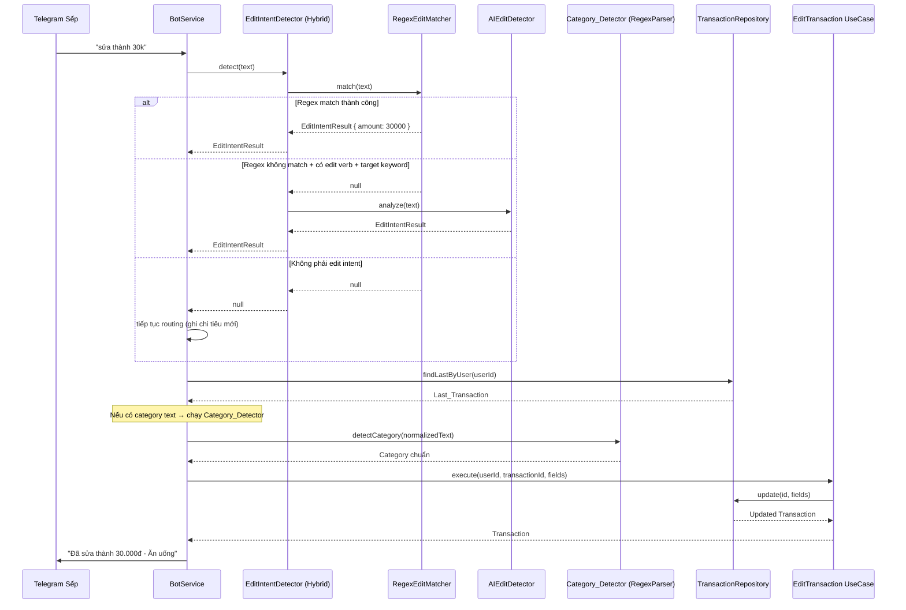

# Design Document: Edit Transaction NLP (Sửa giao dịch bằng ngôn ngữ tự nhiên)

## Overview

Tính năng thay thế cơ chế sửa giao dịch cứng nhắc hiện tại (regex đơn giản + RAM cache) bằng một hệ thống nhận diện ý định sửa theo cơ chế **lai (hybrid)**: Regex trước → AI (Gemini) fallback. Mục tiêu là cho phép sếp sửa giao dịch gần nhất bằng ngôn ngữ tự nhiên tiếng Việt mà không cần nhớ cú pháp.

### Quyết định thiết kế chính

1. **Hybrid strategy (Regex → AI)**: Giống `HybridParser` đã có — regex nhanh/miễn phí xử lý 80%+ cases phổ biến, chỉ gọi Gemini khi câu phức tạp/mơ hồ mà regex không cover.
2. **Database-first** thay vì RAM cache: Luôn gọi `findLastByUser` thay vì dựa vào `lastTransactionIds` Map — bền vững qua restart, consistent.
3. **Reuse existing pipeline**: Tận dụng `detectCategory`, `expandAbbreviations`, `normalizeSpelling`, `detectDate` từ `RegexParser` cho việc detect danh mục và ngày.
4. **Disambiguation by Edit_Target_Keyword**: Chỉ coi là ý định sửa khi có động từ sửa + từ khóa mục tiêu ("thành", "sang", "lại", "danh mục", "ngày", "về"). "sửa xe 50k" → ghi chi tiêu mới.
5. **Save-and-show**: Không hỏi xác nhận, lưu ngay và hiển thị kết quả.


## Architecture



### Vị trí trong routing order (BotService.onMessage)

```
1. id command
2. /start command
3. Access check
4. /help command
5. Compare months (unsupported)
6. Undo/Delete (UNDO_REGEX)
7. ★ Edit Transaction (EditIntentDetector) ← NEW, thay thế EDIT_AMOUNT_REGEX + EDIT_CATEGORY_REGEX
8. Trend report (TREND_REPORT_REGEX)
9. Weekly/monthly report (REPORT_REGEX)
10. Record new transaction (fallthrough)
```


## Components and Interfaces

### EditIntentDetector (Domain Port)

**Path:** `src/domain/ports/EditIntentDetector.ts`

```typescript
export interface EditIntentResult {
  isEditIntent: true;
  fields: {
    amount?: number;      // VND amount đã normalize
    category?: string;    // raw text mô tả danh mục (chưa detect thành category chuẩn)
    note?: string;        // text gốc sếp nhập
    spentAt?: Date;       // ngày tính từ tham chiếu tương đối
  };
  isIncomplete: boolean;  // true khi có edit verb nhưng không trích xuất được field nào
}

export interface EditIntentDetector {
  /**
   * Phân tích message để xác định có phải ý định sửa giao dịch hay không.
   * @returns EditIntentResult nếu là edit intent, null nếu không phải
   */
  detect(text: string): Promise<EditIntentResult | null>;
}
```

### RegexEditMatcher (Infrastructure)

**Path:** `src/infrastructure/parsers/RegexEditMatcher.ts`

```typescript
import { Injectable } from "@nestjs/common";
import { EditIntentResult } from "../../domain/ports/EditIntentDetector";
import { detectDate } from "./RegexParser";

/** Động từ sửa */
const EDIT_VERBS = /^(sửa|sua|đổi|doi|chỉnh|chinh|edit)/i;

/** Từ khóa mục tiêu - xác nhận ý định sửa */
const EDIT_TARGET_KEYWORDS = /(?:thành|thanh|sang|lại|lai|danh\s*mục|ngày|ngay|về|ve)/i;

/**
 * Pattern 1: Sửa số tiền — "sửa thành 30k", "đổi sang 500k", "sửa lại 50k"
 * Captures: amount + unit
 */
const EDIT_AMOUNT_PATTERN = /^(?:sửa|sua|đổi|doi|chỉnh|chinh|edit)\s+(?:thành|thanh|sang|lại|lai|về|ve)\s+(\d+(?:[.,]\d+)?)\s*(k|nghìn|ngàn|tr|triệu)?$/i;

/**
 * Pattern 2: Sửa số tiền bare — "sửa 30k" (không có target keyword nhưng chỉ có số)
 * Chỉ match khi KHÔNG có danh từ/mô tả trước số (loại bỏ "sửa xe 50k")
 */
const EDIT_AMOUNT_BARE_PATTERN = /^(?:sửa|sua|đổi|doi|chỉnh|chinh|edit)\s+(\d+(?:[.,]\d+)?)\s*(k|nghìn|ngàn|tr|triệu)$/i;

/**
 * Pattern 3: Sửa danh mục — "sửa thành ăn uống", "đổi danh mục grab", "sửa lại thành cà phê"
 * Captures: category text
 */
const EDIT_CATEGORY_PATTERN = /^(?:sửa|sua|đổi|doi|chỉnh|chinh|edit)\s+(?:thành|thanh|sang|lại\s*thành|lai\s*thanh|danh\s*mục(?:\s*(?:thành|sang|qua))?)\s+(.+?)(?:\s+(\d+(?:[.,]\d+)?)\s*(k|nghìn|ngàn|tr|triệu)?)?$/i;

/**
 * Pattern 4: Sửa ngày — "sửa ngày hôm qua", "đổi thành hôm kia", "sửa lại 3 ngày trước"
 */
const EDIT_DATE_PATTERN = /^(?:sửa|sua|đổi|doi|chỉnh|chinh|edit)\s+(?:ngày|ngay|thành|thanh|sang|lại|lai|về|ve)\s*(hôm\s*qua|hôm\s*kia|hq|\d+\s*(?:ngày|hôm)\s*trước)/i;

/**
 * Pattern 5: Incomplete — "sửa lại", "sửa", "sửa danh mục" (không kèm nội dung)
 */
const EDIT_INCOMPLETE_PATTERN = /^(?:sửa|sua|đổi|doi|chỉnh|chinh|edit)(?:\s+(?:lại|lai|danh\s*mục|ngày|ngay))?$/i;

/**
 * Anti-pattern: "sửa xe 50k", "sửa điện thoại 200k"
 * Edit verb + noun/description + amount, WITHOUT target keyword
 * → đây là ghi chi tiêu mới, KHÔNG phải sửa
 */
const EXPENSE_DISGUISED_PATTERN = /^(?:sửa|sua|đổi|doi|chỉnh|chinh|edit)\s+(?!thành|thanh|sang|lại|lai|danh\s*mục|ngày|ngay|về|ve)\S+.*\d+\s*(k|nghìn|ngàn|tr|triệu)/i;

@Injectable()
export class RegexEditMatcher {
  match(text: string): EditIntentResult | null {
    const trimmed = text.trim();

    // Anti-pattern check first: "sửa xe 50k" → NOT an edit
    if (EXPENSE_DISGUISED_PATTERN.test(trimmed)) return null;

    // Must start with edit verb
    if (!EDIT_VERBS.test(trimmed)) return null;

    // Pattern 5: Incomplete
    if (EDIT_INCOMPLETE_PATTERN.test(trimmed)) {
      return { isEditIntent: true, fields: {}, isIncomplete: true };
    }

    // Pattern 4: Date edit
    const dateMatch = trimmed.match(EDIT_DATE_PATTERN);
    if (dateMatch) {
      const dateRef = dateMatch[1];
      const spentAt = detectDate(dateRef);
      if (spentAt) {
        return { isEditIntent: true, fields: { spentAt }, isIncomplete: false };
      }
      return { isEditIntent: true, fields: {}, isIncomplete: true };
    }

    // Pattern 1: Amount with target keyword
    const amountMatch = trimmed.match(EDIT_AMOUNT_PATTERN);
    if (amountMatch) {
      const amount = this.normalizeAmount(amountMatch[1], amountMatch[2]);
      return { isEditIntent: true, fields: { amount }, isIncomplete: false };
    }

    // Pattern 2: Amount bare (no keyword but just number)
    const amountBareMatch = trimmed.match(EDIT_AMOUNT_BARE_PATTERN);
    if (amountBareMatch) {
      const amount = this.normalizeAmount(amountBareMatch[1], amountBareMatch[2]);
      return { isEditIntent: true, fields: { amount }, isIncomplete: false };
    }

    // Pattern 3: Category (may include amount)
    const categoryMatch = trimmed.match(EDIT_CATEGORY_PATTERN);
    if (categoryMatch) {
      const fields: EditIntentResult["fields"] = {
        category: categoryMatch[1].trim(),
        note: categoryMatch[1].trim(),
      };
      if (categoryMatch[2]) {
        fields.amount = this.normalizeAmount(categoryMatch[2], categoryMatch[3]);
      }
      return { isEditIntent: true, fields, isIncomplete: false };
    }

    // Has edit verb + target keyword but no pattern matched → incomplete
    if (EDIT_TARGET_KEYWORDS.test(trimmed)) {
      return { isEditIntent: true, fields: {}, isIncomplete: true };
    }

    return null;
  }

  private normalizeAmount(rawNumber: string, unit?: string): number {
    const value = parseFloat(rawNumber.replace(",", "."));
    if (!unit) return value >= 1000 ? value : value * 1000;
    const u = unit.toLowerCase();
    if (u === "k" || u.startsWith("ngh") || u.startsWith("ngà")) return value * 1000;
    if (u === "tr" || u.startsWith("triệu")) return value * 1_000_000;
    return value;
  }
}
```


### AIEditDetector (Infrastructure)

**Path:** `src/infrastructure/parsers/AIEditDetector.ts`

```typescript
import { Injectable, Inject, Logger } from "@nestjs/common";
import { ConfigType } from "@nestjs/config";
import { GoogleGenerativeAI } from "@google/generative-ai";
import { EditIntentResult } from "../../domain/ports/EditIntentDetector";
import { aiConfig } from "../config/app.config";

@Injectable()
export class AIEditDetector {
  private readonly logger = new Logger(AIEditDetector.name);
  private readonly model;

  constructor(
    @Inject(aiConfig.KEY) private readonly config: ConfigType<typeof aiConfig>,
  ) {
    const genAI = new GoogleGenerativeAI(config.geminiApiKey);
    this.model = genAI.getGenerativeModel({
      model: config.geminiModel,
      generationConfig: {
        temperature: 0,
        maxOutputTokens: 300,
        responseMimeType: "application/json",
      },
    });
  }

  async analyze(text: string): Promise<EditIntentResult | null> {
    try {
      const result = await this.model.generateContent([
        EDIT_INTENT_PROMPT,
        `Tin nhắn: "${text}"`,
      ]);
      const content = result.response.text();
      if (!content) return null;

      const parsed = JSON.parse(content);
      if (!parsed.isEditIntent) return null;

      const fields: EditIntentResult["fields"] = {};
      if (parsed.amount) fields.amount = Number(parsed.amount);
      if (parsed.category) {
        fields.category = parsed.category;
        fields.note = parsed.category;
      }
      if (parsed.dateRef) {
        // Delegate date parsing to detectDate
        const { detectDate } = require("./RegexParser");
        const date = detectDate(parsed.dateRef);
        if (date) fields.spentAt = date;
      }

      const hasFields = Object.keys(fields).length > 0;
      return {
        isEditIntent: true,
        fields,
        isIncomplete: !hasFields,
      };
    } catch (error) {
      this.logger.error(`AI edit detection failed: ${(error as Error).message}`);
      throw error; // Let HybridEditDetector handle the error
    }
  }
}
```

### Gemini Prompt Design (AI_Edit_Detector)

```typescript
const EDIT_INTENT_PROMPT = `Bạn là trợ lý phân tích ý định sửa giao dịch chi tiêu. Cho một tin nhắn tiếng Việt, hãy xác định xem người dùng có muốn SỬA khoản giao dịch gần nhất hay không.

Ý định sửa: người dùng muốn thay đổi số tiền, danh mục, nội dung, hoặc ngày của khoản GẦN NHẤT.
KHÔNG phải ý định sửa: người dùng muốn ghi khoản CHI TIÊU MỚI (ví dụ "sửa xe 50k" = chi phí sửa xe).

Quy tắc phân biệt:
- Có động từ sửa (sửa, đổi, chỉnh, edit) + từ khóa mục tiêu (thành, sang, lại, danh mục, ngày, về) → ý định SỬA
- Có động từ sửa + danh từ/mô tả + số tiền, KHÔNG có từ khóa mục tiêu → CHI TIÊU MỚI (return isEditIntent: false)

Nếu là ý định sửa, trích xuất:
- amount: số tiền mới (đơn vị VND, đã nhân k=1000, tr=1000000). null nếu không đề cập
- category: tên danh mục/mô tả mới. null nếu không đề cập
- dateRef: tham chiếu ngày ("hôm qua", "hôm kia", "3 ngày trước"). null nếu không đề cập

Trả về JSON, không giải thích:
{"isEditIntent": boolean, "amount": number|null, "category": string|null, "dateRef": string|null}

Ví dụ:
- "sửa lại thành cà phê 30k hôm qua" → {"isEditIntent": true, "amount": 30000, "category": "cà phê", "dateRef": "hôm qua"}
- "đổi sang ăn uống" → {"isEditIntent": true, "amount": null, "category": "ăn uống", "dateRef": null}
- "sửa xe 50k" → {"isEditIntent": false, "amount": null, "category": null, "dateRef": null}
- "chỉnh lại thành 100k" → {"isEditIntent": true, "amount": 100000, "category": null, "dateRef": null}`;
```


### HybridEditDetector (Infrastructure)

**Path:** `src/infrastructure/parsers/HybridEditDetector.ts`

```typescript
import { Injectable, Logger } from "@nestjs/common";
import { EditIntentDetector, EditIntentResult } from "../../domain/ports/EditIntentDetector";
import { RegexEditMatcher } from "./RegexEditMatcher";
import { AIEditDetector } from "./AIEditDetector";

/** Động từ sửa — dùng để quyết định có escalate lên AI không */
const EDIT_VERB_REGEX = /(?:sửa|sua|đổi|doi|chỉnh|chinh|edit)/i;

/** Từ khóa mục tiêu — phải có ít nhất 1 cái thì mới gọi AI */
const TARGET_KEYWORD_REGEX = /(?:thành|thanh|sang|lại|lai|danh\s*mục|ngày|ngay|về|ve)/i;

@Injectable()
export class HybridEditDetector implements EditIntentDetector {
  private readonly logger = new Logger(HybridEditDetector.name);

  constructor(
    private readonly regexMatcher: RegexEditMatcher,
    private readonly aiDetector: AIEditDetector,
  ) {}

  async detect(text: string): Promise<EditIntentResult | null> {
    // Step 1: Try regex (fast, free)
    const regexResult = this.regexMatcher.match(text);
    if (regexResult !== null) {
      return regexResult;
    }

    // Step 2: Check if message has edit verb + target keyword → escalate to AI
    if (EDIT_VERB_REGEX.test(text) && TARGET_KEYWORD_REGEX.test(text)) {
      this.logger.debug(`Escalating to AI for edit detection: "${text}"`);
      try {
        return await this.aiDetector.analyze(text);
      } catch (error) {
        this.logger.error(`AI edit detection failed, returning error signal`);
        throw error; // BotService sẽ catch và thông báo lỗi
      }
    }

    // Step 3: No edit intent detected
    return null;
  }
}
```

### Tích hợp vào BotService

**Thay đổi trong** `src/infrastructure/channels/bot.service.ts`:

```typescript
// REMOVE:
// - const EDIT_AMOUNT_REGEX = ...
// - const EDIT_CATEGORY_REGEX = ...
// - private readonly lastTransactionIds = new Map<string, string>();
// - private async handleEditAmount(...)
// - private async handleEditCategory(...)

// ADD constructor dependency:
constructor(
  // ... existing deps ...
  @Inject("EditIntentDetector") private readonly editIntentDetector: EditIntentDetector,
) {}

// REPLACE edit routing block in onMessage:
// (sau UNDO_REGEX check, trước TREND_REPORT_REGEX check)
try {
  const editResult = await this.editIntentDetector.detect(message.text.trim());
  if (editResult) {
    await this.handleEditIntent(message.userId, editResult);
    return;
  }
} catch (error) {
  // AI unavailable — thông báo lỗi, KHÔNG ghi khoản mới
  this.logger.error("Edit intent detection failed", error);
  await this.channelAdapter.sendText(
    message.userId,
    "Em đang gặp sự cố khi xử lý yêu cầu sửa, sếp thử lại sau hoặc gõ theo mẫu: \"sửa thành 30k\" nhé 🙏"
  );
  return;
}
```

### handleEditIntent (New method in BotService)

```typescript
private async handleEditIntent(userId: string, result: EditIntentResult): Promise<void> {
  // Incomplete — hỏi lại sếp
  if (result.isIncomplete) {
    await this.channelAdapter.sendText(userId,
      `Sếp muốn sửa gì ạ? Em hỗ trợ sửa:\n` +
      `• Số tiền: "sửa thành 30k"\n` +
      `• Danh mục: "sửa thành ăn uống"\n` +
      `• Ngày: "sửa ngày hôm qua"\n` +
      `• Hoặc kết hợp: "sửa thành cà phê 25k hôm qua"`
    );
    return;
  }

  // Tìm khoản gần nhất qua DB
  const lastTx = await this.transactionRepository.findLastByUser(userId);
  if (!lastTx) {
    await this.channelAdapter.sendText(userId,
      "Không tìm thấy khoản nào để sửa. Sếp thử ghi khoản mới trước nhé."
    );
    return;
  }

  // Build fields cho EditTransaction
  const fields: EditTransactionFields = {};

  if (result.fields.amount !== undefined) {
    fields.amount = result.fields.amount;
  }

  if (result.fields.category) {
    // Chạy Category_Detector pipeline
    const lowered = result.fields.category.toLowerCase();
    const expanded = expandAbbreviations(lowered);
    const normalized = normalizeSpelling(expanded);
    const resolvedCategory = detectCategory(normalized) ?? detectCategory(expanded);

    if (!resolvedCategory) {
      await this.channelAdapter.sendText(userId,
        `Em chưa nhận ra danh mục "${result.fields.category}". Sếp chọn một trong các danh mục:\n\n` +
        `Ăn uống, Di chuyển, Mua sắm, Nhà ở, Tiện ích, Internet, ` +
        `Sức khỏe, Giáo dục, Giải trí, Con cái, Chi phí cố định, ` +
        `Tiết kiệm & Đầu tư, Thu nhập, Khác`
      );
      return;
    }

    fields.category = resolvedCategory;
    fields.note = result.fields.note ?? result.fields.category;
  }

  if (result.fields.spentAt) {
    // Validate: không cho phép ngày tương lai
    const now = new Date();
    if (result.fields.spentAt > now) {
      await this.channelAdapter.sendText(userId,
        "Em không thể đặt ngày trong tương lai. Sếp thử \"sửa ngày hôm qua\" hoặc \"sửa 3 ngày trước\" nhé."
      );
      return;
    }
    fields.spentAt = result.fields.spentAt;
  }

  // Execute edit
  const updated = await this.editTransaction.execute(userId, lastTx.id!, fields);
  if (!updated) {
    await this.channelAdapter.sendText(userId,
      "Không sửa được, khoản có thể đã bị xoá."
    );
    return;
  }

  // Format response
  const displayAmount = Math.abs(updated.amount).toLocaleString("vi-VN");
  const isIncome = updated.amount < 0;
  const verb = isIncome ? "sửa thu nhập thành" : "sửa thành";
  await this.channelAdapter.sendText(userId,
    `Đã ${verb} ${displayAmount}đ - ${updated.category}` +
    (updated.note && updated.note !== updated.category ? ` (${updated.note})` : "") +
    "."
  );
}
```


### Xoá bỏ (Deprecated Code)

Các thành phần sau sẽ bị **xoá hoàn toàn** khỏi `bot.service.ts`:

| Thành phần | Lý do xoá |
|---|---|
| `EDIT_AMOUNT_REGEX` | Thay thế bởi `RegexEditMatcher` — pattern linh hoạt hơn, không yêu cầu số cũ |
| `EDIT_CATEGORY_REGEX` | Thay thế bởi `RegexEditMatcher` — hỗ trợ thêm "lại thành", "danh mục qua" |
| `lastTransactionIds: Map<string, string>` | Thay thế bởi `findLastByUser` — bền vững qua restart |
| `handleEditAmount(userId, match)` | Thay thế bởi `handleEditIntent` |
| `handleEditCategory(userId, rawInput)` | Thay thế bởi `handleEditIntent` |

**Lưu ý**: `lastTransactionIds.set()` trong phần record transaction cũng bị xoá (không cần cache nữa).

### Module Registration

**Path:** `src/infrastructure/infrastructure.module.ts`

```typescript
import { RegexEditMatcher } from "./parsers/RegexEditMatcher";
import { AIEditDetector } from "./parsers/AIEditDetector";
import { HybridEditDetector } from "./parsers/HybridEditDetector";

@Global()
@Module({
  // ... existing ...
  providers: [
    // ... existing providers ...
    RegexEditMatcher,
    AIEditDetector,
    { provide: "EditIntentDetector", useClass: HybridEditDetector },
  ],
  exports: [
    // ... existing exports ...
    "EditIntentDetector",
  ],
})
export class InfrastructureModule {}
```

**BotService** inject thêm:
```typescript
@Inject("EditIntentDetector") private readonly editIntentDetector: EditIntentDetector,
@Inject("TransactionRepository") private readonly transactionRepository: TransactionRepository,
```

## Data Models

### EditIntentResult (New — Domain)

```typescript
// src/domain/ports/EditIntentDetector.ts
export interface EditIntentResult {
  isEditIntent: true;
  fields: {
    amount?: number;      // VND amount đã normalize (luôn dương, sign xử lý bởi EditTransaction)
    category?: string;    // raw text mô tả (sẽ được detect thành Category chuẩn bởi BotService)
    note?: string;        // text gốc sếp nhập cho note field
    spentAt?: Date;       // ngày đã tính từ tham chiếu tương đối
  };
  isIncomplete: boolean;  // true = có edit verb nhưng không extract được field cụ thể
}
```

### EditTransactionFields (Existing — Application)

Đã tồn tại tại `src/application/usecases/EditTransaction.ts`:

```typescript
export interface EditTransactionFields {
  amount?: number;
  category?: string;
  note?: string;
  spentAt?: Date;
}
```

Không cần thay đổi — `EditTransaction.execute()` đã xử lý sign convention (income = negative) và ownership check.


## Edge Cases & Disambiguation

| # | Message | Expected Behavior | Lý do |
|---|---------|-------------------|-------|
| 1 | `sửa thành 30k` | Edit amount → 30,000đ | Pattern 1: edit verb + target keyword + amount |
| 2 | `sửa 30k` | Edit amount → 30,000đ | Pattern 2: edit verb + bare amount (no noun before) |
| 3 | `sửa xe 50k` | **Ghi chi tiêu mới** — Di chuyển 50,000đ | Anti-pattern: edit verb + noun + amount, NO target keyword |
| 4 | `sửa điện thoại 200k` | **Ghi chi tiêu mới** — Internet 200,000đ | Anti-pattern: same as #3 |
| 5 | `sửa thành ăn uống` | Edit category → "Ăn uống" | Pattern 3: edit verb + target keyword + category text |
| 6 | `đổi danh mục grab` | Edit category → "Di chuyển", note="grab" | Pattern 3: "danh mục" keyword + text |
| 7 | `sửa lại thành cà phê` | Edit category → "Ăn uống", note="cà phê" | Pattern 3: "lại thành" compound target |
| 8 | `sửa lại` | **Incomplete** — hỏi lại sếp | Pattern 5: edit verb + "lại" nhưng không có nội dung |
| 9 | `sửa danh mục` | **Incomplete** — hỏi lại sếp | Pattern 5: edit verb + "danh mục" nhưng không có tên |
| 10 | `sửa` | **Incomplete** — hỏi lại sếp | Pattern 5: chỉ edit verb |
| 11 | `sửa ngày hôm qua` | Edit spentAt → yesterday | Pattern 4: edit verb + "ngày" + date ref |
| 12 | `đổi thành hôm kia` | Edit spentAt → 2 days ago | Pattern 4: "thành" + date ref |
| 13 | `sửa thành ăn uống 30k hôm qua` | Edit all: category="Ăn uống", amount=30000, spentAt=yesterday | Multi-field (regex hoặc AI) |
| 14 | `chỉnh lại thành 100k` | Edit amount → 100,000đ | "chỉnh" also recognized as edit verb |
| 15 | `sửa thành blah blah` | Category not found → liệt kê 14 danh mục | Category_Detector returns null |
| 16 | `sửa sang cf` | Edit category → "Ăn uống", note="cf" | Abbreviation expansion: cf → cà phê |
| 17 | `edit sang 1tr` | Edit amount → 1,000,000đ | "edit" also recognized |
| 18 | `ăn trưa 50k` | **Ghi chi tiêu mới** — bình thường | Không có edit verb → pass through |
| 19 | `sửa thành tiết kiệm 5tr` | Edit: category="Tiết kiệm & Đầu tư", amount=-5,000,000đ | Income category → negative amount |


## Correctness Properties

*A property is a characteristic or behavior that should hold true across all valid executions of a system — essentially, a formal statement about what the system should do. Properties serve as the bridge between human-readable specifications and machine-verifiable correctness guarantees.*

### Property 1: Regex-first invariant (AI never called when Regex succeeds)

*For any* message text where `RegexEditMatcher.match()` returns a non-null `EditIntentResult`, the `AIEditDetector.analyze()` method SHALL NOT be invoked.

**Validates: Requirements 1.1, 1.2**

### Property 2: Disambiguation — expense-disguised messages never detected as edit

*For any* message that starts with an edit verb, followed by a non-keyword noun/description, followed by an amount with unit, and does NOT contain any Edit_Target_Keyword, the `EditIntentDetector.detect()` SHALL return null.

**Validates: Requirements 1.4, 9.3**

### Property 3: Amount normalization consistency

*For any* raw amount string with unit (k/nghìn/ngàn → ×1000, tr/triệu → ×1000000, bare ≥1000 → giữ nguyên), the `RegexEditMatcher.normalizeAmount()` SHALL return the correct VND value matching the multiplication rule.

**Validates: Requirements 2.3**

### Property 4: Income sign convention on amount edit

*For any* edit that changes the amount of a transaction: if the transaction's effective category is an Income_Category, the stored amount SHALL be negative with absolute value equal to the new VND_Amount; otherwise the stored amount SHALL be positive equal to the new VND_Amount.

**Validates: Requirements 2.4, 2.5, 3.5, 3.6, 4.3**

### Property 5: Category detection pipeline preserves standard name

*For any* category edit where the raw text input maps to a known Category via `detectCategory(normalizeSpelling(expandAbbreviations(text.toLowerCase())))`, the stored `category` field SHALL exactly equal one of the 14 standard Category names.

**Validates: Requirements 3.1, 3.2**

### Property 6: Note preservation on category edit

*For any* category edit message, the stored `note` field SHALL equal the original text description provided by the user (trước khi detect thành category chuẩn).

**Validates: Requirements 3.3**

### Property 7: Multi-field edit atomicity

*For any* edit message containing N extracted fields (N ≥ 1), exactly those N fields SHALL be updated in the transaction, and all other fields SHALL remain unchanged from their pre-edit values.

**Validates: Requirements 4.1, 4.4**

### Property 8: Incomplete edit never records new transaction

*For any* message where `EditIntentDetector` returns `isIncomplete: true` or returns a non-null result with `isEditIntent: true`, the bot SHALL NOT invoke `RecordTransaction` and SHALL NOT create a new transaction.

**Validates: Requirements 8.1, 8.2, 8.3**

### Property 9: Response format contains VND amount and category

*For any* successful edit operation, the bot response message SHALL contain the formatted absolute amount (with VND separators and "đ" suffix) AND the Category name of the transaction after edit.

**Validates: Requirements 7.2, 7.3**

### Property 10: AI escalation condition

*For any* message where `RegexEditMatcher.match()` returns null AND the message contains both an edit verb and at least one Edit_Target_Keyword, the `HybridEditDetector` SHALL invoke `AIEditDetector.analyze()`.

**Validates: Requirements 1.3**


## Error Handling

| Scenario | Xử lý | Message cho sếp |
|----------|--------|-----------------|
| AI_Edit_Detector timeout / API error | Catch error, log, thông báo sếp | "Em đang gặp sự cố khi xử lý yêu cầu sửa, sếp thử lại sau hoặc gõ theo mẫu: \"sửa thành 30k\" nhé 🙏" |
| `findLastByUser` trả về null | Không có khoản nào để sửa | "Không tìm thấy khoản nào để sửa. Sếp thử ghi khoản mới trước nhé." |
| `EditTransaction.execute` trả về null | Khoản đã bị xoá hoặc không thuộc sếp | "Không sửa được, khoản có thể đã bị xoá." |
| `Category_Detector` trả về null | Danh mục không nhận ra | "Em chưa nhận ra danh mục \"...\". Sếp chọn một trong các danh mục: [14 danh mục]" |
| Ngày tính ra rơi vào tương lai | Reject date update | "Em không thể đặt ngày trong tương lai. Sếp thử \"sửa ngày hôm qua\"..." |
| Database write failure (repository.update throws) | Catch, log error | "Hệ thống đang gặp sự cố tạm thời, sếp thử lại sau nhé 🙏" |
| Incomplete edit (verb only, no content) | Hỏi lại sếp | "Sếp muốn sửa gì ạ? Em hỗ trợ sửa: [ví dụ]" |
| Amount edit nhưng không parse được số | isIncomplete=true | Giống incomplete edit ở trên |

**Nguyên tắc**: Khi có lỗi ở bước edit detection hoặc AI, KHÔNG BAO GIỜ chuyển message sang luồng ghi khoản mới. Luôn trả message lỗi và `return` sớm.

## Testing Strategy

### Property-Based Tests (fast-check)

Sử dụng thư viện [fast-check](https://github.com/dubzzz/fast-check) cho TypeScript.

Mỗi property test chạy tối thiểu **100 iterations**.

| Property | Test approach | Generator |
|----------|---------------|-----------|
| Property 1: Regex-first | Generate messages matching regex patterns, verify AI mock NOT called | Arbitrary edit messages with valid patterns |
| Property 2: Disambiguation | Generate "sửa + noun + amount" messages without target keywords | `fc.record({ verb, noun, amount, unit })` |
| Property 3: Amount normalization | Generate `(number, unit)` pairs, verify multiplication | `fc.tuple(fc.float({min:1, max:999}), fc.constantFrom("k","tr","nghìn","triệu"))` |
| Property 4: Income sign | Generate edits on transactions with random categories, verify sign | `fc.record({ category: fc.constantFrom(...14cats), amount: fc.nat() })` |
| Property 5: Category pipeline | Generate texts that map to known categories | Random keywords from CATEGORY_KEYWORDS |
| Property 6: Note preservation | Generate category edits, verify note = original text | `fc.string()` filtered to non-empty |
| Property 7: Multi-field atomicity | Generate subsets of fields, verify only those changed | `fc.subarray(["amount","category","spentAt"])` |
| Property 8: Incomplete never records | Generate incomplete edit messages, verify no RecordTransaction call | Edit verb + optional "lại"/"danh mục" |
| Property 9: Response format | Generate successful edits, verify response contains VND format | Random amounts + categories |
| Property 10: AI escalation | Generate messages with verb+keyword that don't match regex | Complex Vietnamese sentences |

### Unit Tests (Example-Based)

| Test | Covers |
|------|--------|
| "sửa thành 30k" → amount=30000 | Req 2.1 |
| "sửa xe 50k" → null (not edit) | Req 1.4, 9.3 |
| "sửa lại" → incomplete | Req 8.1 |
| "đổi danh mục grab" → category="Di chuyển" | Req 3.1 |
| "sửa ngày hôm qua" → spentAt=yesterday | Req 5.1 |
| "sửa thành ăn uống 30k hôm qua" → multi-field | Req 4.1 |
| findLastByUser returns null → error message | Req 6.4 |
| AI throws error → fallback error message, no new transaction | Req 1.6 |
| "sửa thành xyz" (unknown category) → list 14 categories | Req 3.4 |
| Category changes from expense to income → amount becomes negative | Req 3.5 |

### Integration Tests

| Test | Covers |
|------|--------|
| Full flow: message → detect → findLastByUser → edit → response | Req 7.1 |
| Existing tests still pass (undo, report, record) | Req 9.4, 9.5 |
| After process restart, edit still finds correct last transaction | Req 6.3 |

### File Organization

```
src/
  domain/
    ports/
      EditIntentDetector.ts          [NEW]
  infrastructure/
    parsers/
      RegexEditMatcher.ts            [NEW]
      AIEditDetector.ts              [NEW]
      HybridEditDetector.ts          [NEW]
    channels/
      bot.service.ts                 [MODIFIED — remove old edit logic, add new handleEditIntent]
    infrastructure.module.ts         [MODIFIED — register new providers]
test/
  parsers/
    regex-edit-matcher.spec.ts       [NEW]
    hybrid-edit-detector.spec.ts     [NEW]
  channels/
    bot-edit-intent.spec.ts          [NEW]
  properties/
    edit-intent-detection.prop.ts    [NEW — property-based tests]
```
