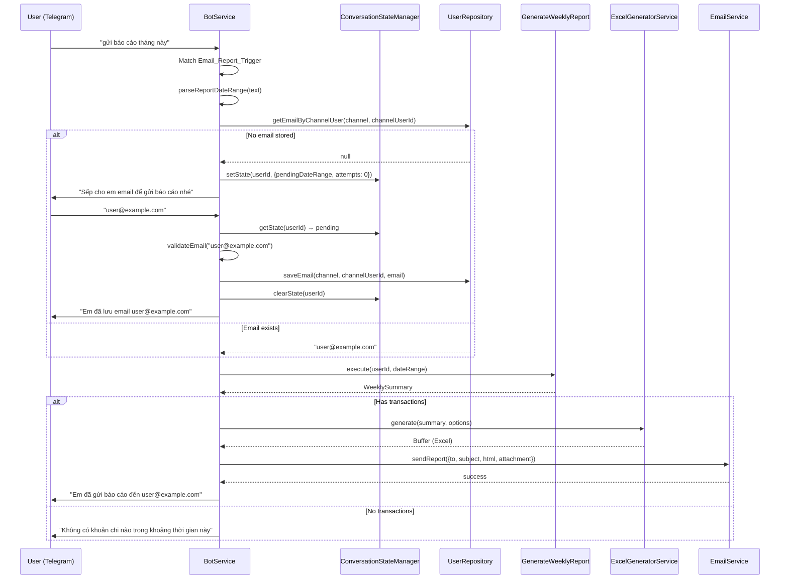
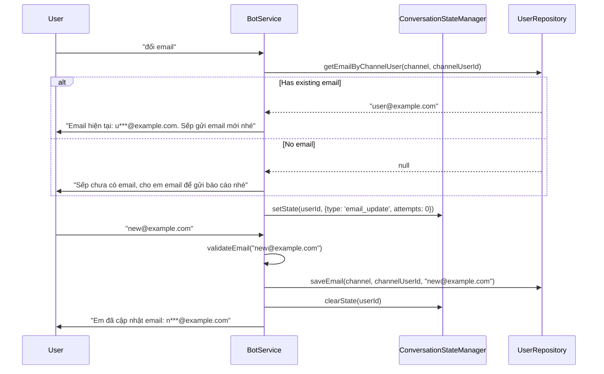
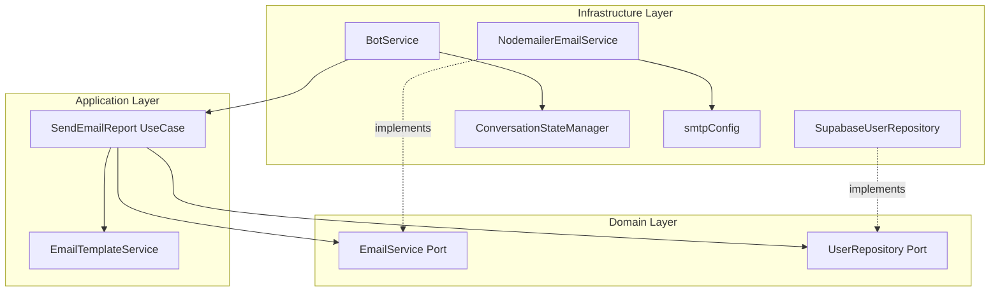

# Design Document: Email Report Delivery

## Overview

This feature adds the ability for users to request expense reports via email through the Telegram bot. The system detects email-specific trigger phrases, collects the user's email address on first use, generates an Excel report using the existing `ExcelGeneratorService`, and delivers it as an email attachment with a professional HTML body.

The design integrates into the existing clean architecture by introducing new ports (`EmailService`, `UserRepository`) and infrastructure implementations (`NodemailerEmailService`, `SupabaseUserRepository`), plus an in-memory `ConversationStateManager` for the email collection flow.

## Architecture

### High-Level Flow



### Email Update Flow



### Module Integration



## Components and Interfaces

### Domain Ports

#### EmailService (Port)

```typescript
// src/domain/ports/EmailService.ts
export interface EmailAttachment {
  filename: string;
  content: Buffer;
  contentType: string;
}

export interface SendEmailOptions {
  to: string;
  subject: string;
  html: string;
  attachments: EmailAttachment[];
}

export interface EmailService {
  send(options: SendEmailOptions): Promise<void>;
}
```

#### UserRepository (Port)

```typescript
// src/domain/ports/UserRepository.ts
export interface UserRepository {
  getEmailByChannelUser(channel: string, channelUserId: string): Promise<string | null>;
  saveEmail(channel: string, channelUserId: string, email: string): Promise<void>;
}
```

### Application Services

#### EmailTemplateService

```typescript
// src/application/services/EmailTemplateService.ts
export interface EmailTemplateService {
  renderReportEmail(summary: WeeklySummary): string;
}
```

Produces a complete HTML string with inline CSS. Takes `WeeklySummary` and returns HTML containing:
- Branded header with report period (dd/MM/yyyy)
- Total expense formatted in VND
- Category breakdown table sorted descending by amount
- Footer note about attached Excel file

#### SendEmailReport (Use Case)

```typescript
// src/application/usecases/SendEmailReport.ts
export class SendEmailReport {
  constructor(
    emailService: EmailService,
    excelGenerator: ExcelGeneratorService,
    templateService: EmailTemplateService,
  ) {}

  async execute(params: {
    email: string;
    summary: WeeklySummary;
    from: Date;
    to: Date;
  }): Promise<void>;
}
```

Orchestrates: generate Excel → render HTML template → send email with attachment. Applies a 30-second timeout on the email send operation.

### Infrastructure

#### ConversationStateManager

```typescript
// src/infrastructure/channels/ConversationStateManager.ts
export type ConversationStateType = 'email_collection' | 'email_update';

export interface ConversationState {
  type: ConversationStateType;
  dateRange?: DateRange;  // original requested range (for email_collection)
  attempts: number;       // invalid email attempt counter
  createdAt: number;      // Date.now() for TTL
}

export class ConversationStateManager {
  private states: Map<string, ConversationState>;
  private readonly TTL_MS = 5 * 60 * 1000; // 5 minutes

  setState(userId: string, state: ConversationState): void;
  getState(userId: string): ConversationState | null; // returns null if expired
  clearState(userId: string): void;
}
```

In-memory `Map<userId, ConversationState>`. On `getState`, checks if `Date.now() - createdAt > TTL_MS` and auto-clears expired entries. No persistence needed since conversation state is ephemeral.

#### NodemailerEmailService

```typescript
// src/infrastructure/email/NodemailerEmailService.ts
@Injectable()
export class NodemailerEmailService implements EmailService {
  private transporter: nodemailer.Transporter;

  constructor(config: SmtpConfig) {
    this.transporter = nodemailer.createTransport({
      host: config.host,
      port: config.port,
      secure: config.secure,
      auth: { user: config.user, pass: config.pass },
    });
  }

  async send(options: SendEmailOptions): Promise<void> {
    // Wraps sendMail with AbortSignal timeout of 30s
  }
}
```

#### SupabaseUserRepository

```typescript
// src/infrastructure/repositories/SupabaseUserRepository.ts
@Injectable()
export class SupabaseUserRepository implements UserRepository {
  constructor(config: SupabaseConfig) {}

  async getEmailByChannelUser(channel: string, channelUserId: string): Promise<string | null>;
  async saveEmail(channel: string, channelUserId: string, email: string): Promise<void>;
}
```

Uses the existing `users` table with a new `email` column. `saveEmail` performs an upsert on `(channel, channel_user_id)`.

#### Email Report Trigger Regex

```typescript
const EMAIL_REPORT_REGEX = /gửi\s*báo\s*cáo|gửi\s*report|gửi\s*email\s*báo\s*cáo|report\s*cho\s*tôi|email\s*report/i;
```

Checked **before** `REPORT_REGEX` in the message handler to ensure priority routing.

#### Email Update Trigger Regex

```typescript
const EMAIL_UPDATE_REGEX = /đổi\s*email|cập\s*nhật\s*email|thay\s*đổi\s*email|sửa\s*email/i;
```

#### Email Validation

```typescript
function isValidEmail(text: string): boolean {
  if (text.length > 254) return false;
  return /^[^\s@]+@[^\s@]+\.[^\s@]+$/.test(text);
}
```

Simple format check: local-part@domain with at least one dot in domain. Max 254 characters per RFC 5321.

#### Email Masking

```typescript
function maskEmail(email: string): string {
  const [local, domain] = email.split('@');
  return `${local[0]}***@${domain}`;
}
```

### SMTP Configuration

```typescript
// src/infrastructure/config/app.config.ts (addition)
export const smtpConfig = registerAs("smtp", () => ({
  host: requireEnv("SMTP_HOST"),
  port: Number(process.env.SMTP_PORT ?? 587),
  secure: process.env.SMTP_SECURE === "true",
  user: requireEnv("SMTP_USER"),
  pass: requireEnv("SMTP_PASS"),
  from: process.env.SMTP_FROM ?? "noreply@oh-my-fast-tracker.app",
}));
```

Environment variables:
- `SMTP_HOST` — SMTP server hostname (e.g., smtp.gmail.com)
- `SMTP_PORT` — port number (default: 587)
- `SMTP_SECURE` — use TLS (default: false, uses STARTTLS on 587)
- `SMTP_USER` — authentication username
- `SMTP_PASS` — authentication password/app-specific password
- `SMTP_FROM` — sender address for outgoing emails

## Data Models

### Database Schema Change

```sql
-- Add email column to existing users table
ALTER TABLE users ADD COLUMN email varchar(254) DEFAULT NULL;
```

The `users` table already has `(channel, channel_user_id)` as a unique constraint, which serves as the lookup key for email retrieval and upsert operations.

### Updated Users Table

| Column | Type | Constraints |
|--------|------|-------------|
| id | uuid | PK, default gen_random_uuid() |
| channel | text | NOT NULL |
| channel_user_id | text | NOT NULL |
| email | varchar(254) | NULLABLE, default NULL |
| created_at | timestamptz | NOT NULL, default now() |

Unique constraint: `(channel, channel_user_id)`

### ConversationState (In-Memory)

```typescript
interface ConversationState {
  type: 'email_collection' | 'email_update';
  dateRange?: DateRange;
  attempts: number;
  createdAt: number;
}
```

Stored in a `Map<string, ConversationState>` keyed by userId. Not persisted to database — lost on restart (acceptable since it's a short-lived flow).

## Correctness Properties

*A property is a characteristic or behavior that should hold true across all valid executions of a system — essentially, a formal statement about what the system should do. Properties serve as the bridge between human-readable specifications and machine-verifiable correctness guarantees.*

### Property 1: Email trigger routing priority

*For any* user message that matches `EMAIL_REPORT_REGEX`, the message SHALL be routed to the email report flow and NOT to the in-chat report flow, regardless of whether it also matches `REPORT_REGEX`.

**Validates: Requirements 1.1, 1.2, 1.5**

### Property 2: Valid email persistence round-trip

*For any* valid email string (matches format, ≤254 chars), after calling `saveEmail(channel, channelUserId, email)`, a subsequent call to `getEmailByChannelUser(channel, channelUserId)` SHALL return that same email string.

**Validates: Requirements 2.2, 4.2**

### Property 3: Invalid email rejection

*For any* string that does not match the email format pattern (`local@domain.tld`), the email validation function SHALL return false, and the bot SHALL not persist the value.

**Validates: Requirements 2.4, 5.4**

### Property 4: Email subject line formatting

*For any* date range (from, to), the email subject line SHALL equal `"Báo cáo chi tiêu {DD/MM/YYYY} - {DD/MM/YYYY}"` where the dates are formatted from the `from` and `to` values respectively.

**Validates: Requirements 3.3**

### Property 5: Attachment filename consistency

*For any* date range (from, to), the Excel attachment filename SHALL match the output of `formatExportFilename(from, to)`, ensuring the existing filename-formatter is reused correctly.

**Validates: Requirements 3.2**

### Property 6: HTML template completeness

*For any* `WeeklySummary` with at least one category, the rendered HTML email body SHALL contain: both dates in dd/MM/yyyy format, the total amount formatted in VND, every category name and its total (sorted descending by amount), and a note about the attached Excel file.

**Validates: Requirements 3.7**

### Property 7: Email upsert overwrites previous value

*For any* sequence of `saveEmail` calls for the same (channel, channelUserId) with different email values, `getEmailByChannelUser` SHALL return only the most recently saved email.

**Validates: Requirements 4.2, 5.3**

### Property 8: Email length enforcement

*For any* string longer than 254 characters, the email validation SHALL reject it (return false) regardless of whether it otherwise matches email format.

**Validates: Requirements 4.4**

### Property 9: Email masking format

*For any* valid email address, the `maskEmail` function SHALL produce a string in the format `{first_char}***@{domain}` where `first_char` is the first character of the local part and `domain` is the full domain portion.

**Validates: Requirements 5.1, 5.5**

## Error Handling

| Scenario | Handling |
|----------|----------|
| Email send fails (SMTP error) | Bot notifies user: "Gửi email không thành công, sếp thử lại sau nhé" |
| Email send timeout (>30s) | Same as send failure — abort and notify user |
| Invalid email format (during collection) | Bot informs user, asks again (max 3 attempts) |
| Max attempts exceeded | Cancel flow, tell user to try again later |
| No transactions in date range | Bot notifies user, no email sent |
| User has no email + email report trigger | Enter email collection flow |
| Conversation state expired (>5 min) | State auto-cleared, message processed normally |
| Database error on email save | Bot sends generic error message, logs error |
| Supabase query failure on email lookup | Bot sends generic error message, logs error |
| Email column value exceeds 254 chars | Rejected at validation before persistence |

## Testing Strategy

### Property-Based Tests (fast-check)

The project already uses `fast-check` (v4.9.0). Each correctness property maps to a single property-based test with minimum 100 iterations.

| Property | Test File | What Varies |
|----------|-----------|-------------|
| P1: Trigger routing | `test/email/email-trigger-routing.spec.ts` | Random messages with/without trigger phrases |
| P2: Email persistence round-trip | `test/email/user-repository.spec.ts` | Random valid emails, channels, userIds |
| P3: Invalid email rejection | `test/email/email-validation.spec.ts` | Random non-email strings |
| P4: Subject formatting | `test/email/email-subject.spec.ts` | Random date ranges |
| P5: Filename consistency | `test/email/email-attachment.spec.ts` | Random date ranges |
| P6: HTML completeness | `test/email/email-template.spec.ts` | Random WeeklySummary objects |
| P7: Upsert overwrites | `test/email/user-repository.spec.ts` | Random email sequences |
| P8: Length enforcement | `test/email/email-validation.spec.ts` | Random long strings |
| P9: Masking format | `test/email/email-masking.spec.ts` | Random valid emails |

Each test tagged with:
```typescript
// Feature: email-report-delivery, Property {N}: {property_text}
```

### Unit Tests (Jest)

Focused on specific flows and edge cases (not covered by property tests):

- Email collection flow: first-time user → ask → save → send report
- Email update flow: existing user → show masked → collect new → confirm
- Conversation state expiry after 5 minutes
- 3 invalid attempts → flow cancellation
- Non-email message during collection → cancel and re-route
- Zero transactions → notify without email
- Email send failure → error notification
- Email send timeout → error notification

### Integration Tests

- End-to-end flow with mocked SMTP (use nodemailer's `createTestAccount`)
- Database migration: verify `email` column exists and accepts values
- UserRepository upsert behavior against real Supabase (test environment)

### Library Choice

- **Email sending**: `nodemailer` — the de facto standard for Node.js email. Well-maintained, supports SMTP, attachments, HTML bodies.
- **Property testing**: `fast-check` — already in devDependencies (v4.9.0)
- **Test framework**: `jest` — already configured in the project
