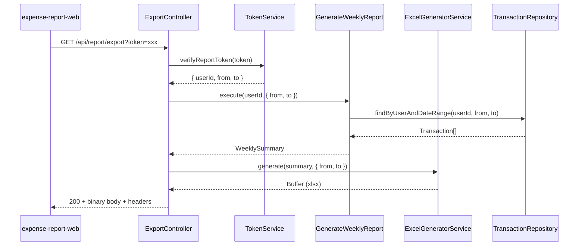

# Design Document: Excel Report Export

## Overview

This feature adds a `GET /api/report/export` endpoint that generates a professionally formatted Excel file from the existing `WeeklySummary` data. The endpoint reuses the same JWT token authentication and `GenerateWeeklyReport` use case as the existing JSON report endpoint, but pipes the result through an `ExcelGeneratorService` that produces a styled `.xlsx` workbook with Vietnamese locale formatting, category charts, and a business-ready layout.

The design follows the existing Clean Architecture layers:
- **Infrastructure (HTTP)** — `ExportController` handles the request/response cycle
- **Application** — `ExcelGeneratorService` transforms `WeeklySummary` → Excel buffer
- **Domain** — No changes; existing `WeeklySummary`, `Transaction`, and `TokenService` interfaces are reused

### Library Choice: ExcelJS

[ExcelJS](https://github.com/exceljs/exceljs) is the recommended library because it supports:
- Cell merging, styling (fonts, fills, borders, alignment)
- Pie charts via the chart API
- Streaming workbook writes to a Buffer (no temp files)
- Active maintenance and strong TypeScript typings

Alternative considered: `xlsx` (SheetJS) — lacks native chart support and has limited free-tier styling. `exceljs` is the better fit for a fully styled report with charts.

## Architecture



The flow is synchronous within a single request. `ExcelGeneratorService` is a pure transformation: it receives a `WeeklySummary` and date range, and returns a `Buffer`. No I/O, no side effects.

## Components and Interfaces

### ExportController

**Path:** `src/infrastructure/http/controllers/export.controller.ts`

```typescript
@Controller("api/report")
export class ExportController {
  constructor(
    private readonly generateWeeklyReport: GenerateWeeklyReport,
    private readonly excelGenerator: ExcelGeneratorService,
    @Inject("TokenService") private readonly tokenService: TokenService,
  ) {}

  @Get("export")
  async exportExcel(
    @Query("token") token: string | undefined,
    @Res() res: Response,
  ): Promise<void>;
}
```

Responsibilities:
- Validate token presence (400 if missing)
- Verify token via `TokenService` (404 if invalid/expired)
- Call `GenerateWeeklyReport.execute()`
- Call `ExcelGeneratorService.generate()`
- Set response headers (`Content-Type`, `Content-Disposition`, `Access-Control-Expose-Headers`)
- Stream the buffer to the response
- Catch unexpected errors → 500 with logged error

### ExcelGeneratorService

**Path:** `src/application/services/ExcelGeneratorService.ts`

```typescript
export interface ExcelGeneratorOptions {
  from: Date;
  to: Date;
}

@Injectable()
export class ExcelGeneratorService {
  generate(summary: WeeklySummary, options: ExcelGeneratorOptions): Promise<Buffer>;
}
```

Responsibilities:
- Build the workbook structure (header section, summary section, transactions section, chart)
- Apply all styling (fonts, borders, fills, column widths)
- Format monetary values in VND
- Sort categories descending by amount
- Sort transactions descending by date (spentAt ?? createdAt)
- Generate pie chart when categories >= 2
- Return the workbook serialized as a Buffer

This lives in the application layer because it's a use-case-adjacent service that orchestrates domain data into an output format, without any infrastructure dependencies (ExcelJS is a library, not an external service).

### VND Formatting Utility

**Path:** `src/application/services/vnd-formatter.ts`

```typescript
export function formatVND(amount: number): string;
```

Pure function that formats a number as Vietnamese currency: period as thousands separator, `₫` suffix. E.g., `1234567` → `"1.234.567 ₫"`.

### Filename Formatting Utility

**Path:** `src/application/services/filename-formatter.ts`

```typescript
export function formatExportFilename(from: Date, to: Date): string;
```

Returns `bao-cao-chi-tieu-{dd-MM-yyyy}-{dd-MM-yyyy}.xlsx`.

## Data Models

No new domain entities are introduced. The feature operates on existing models:

### Input (from token verification)

```typescript
interface ReportTokenPayload {
  userId: string;
  from: string; // ISO date
  to: string;   // ISO date
}
```

### Intermediate (from GenerateWeeklyReport)

```typescript
interface WeeklySummary {
  total: number;
  byCategory: CategorySummary[]; // { category: string; total: number }
  transactions: Transaction[];   // { amount, category, note, spentAt?, createdAt? }
  from: Date;
  to: Date;
}
```

### Output

A `Buffer` representing the serialized `.xlsx` file. The workbook structure:

| Row | Content |
|-----|---------|
| 1 | Title: "BÁO CÁO CHI TIÊU" (merged, centered, bold 16pt) |
| 2 | Date range: "Từ dd/MM/yyyy đến dd/MM/yyyy" (italic 11pt) |
| 3 | Generation date: "Ngày xuất: dd/MM/yyyy HH:mm" (italic 11pt) |
| 4 | Empty separator |
| 5 | "TỔNG QUAN" section header (bold 13pt) |
| 6 | "Tổng chi tiêu: X ₫" |
| 7 | Category table header: Danh mục | Số tiền |
| 8..N | Category rows (sorted descending by amount) |
| N+1 | Empty row |
| N+2.. | Pie chart (if categories >= 2) |
| ... | Empty separator row |
| ... | "CHI TIẾT GIAO DỊCH" section header (bold 13pt) |
| ... | Transaction table header: STT | Ngày | Danh mục | Ghi chú | Số tiền |
| ... | Transaction rows (sorted descending by date) |
| ... | "Tổng cộng" sum row (bold) |

## Correctness Properties

*A property is a characteristic or behavior that should hold true across all valid executions of a system — essentially, a formal statement about what the system should do. Properties serve as the bridge between human-readable specifications and machine-verifiable correctness guarantees.*

### Property 1: VND Currency Formatting Round-Trip

*For any* non-negative integer or decimal amount, `formatVND(amount)` SHALL produce a string with periods as thousands separators and a trailing " ₫" suffix, such that parsing the numeric portion back yields the original amount (to whole-number precision).

**Validates: Requirements 4.2, 4.5, 5.4**

### Property 2: Category Sort Order

*For any* `WeeklySummary` with one or more categories, the generated Excel workbook SHALL present category rows in strictly non-increasing order by amount.

**Validates: Requirements 4.4**

### Property 3: Transaction Sort Order and Sequential STT

*For any* non-empty list of transactions, the generated Excel workbook SHALL sort them by effective date (spentAt ?? createdAt) in descending order, and the STT column values SHALL be the sequence 1, 2, 3, ..., N where N is the number of transactions.

**Validates: Requirements 5.5, 5.6**

### Property 4: Transaction Total Row Integrity

*For any* list of transactions, the "Tổng cộng" row amount in the generated workbook SHALL equal the arithmetic sum of all individual transaction amounts in the table.

**Validates: Requirements 5.7**

### Property 5: Column Width Bounds

*For any* generated workbook, every column width SHALL be at least 8 characters and at most 50 characters.

**Validates: Requirements 6.3**

### Property 6: Report Structure Invariants

*For any* valid `WeeklySummary` input (including empty transactions/categories), the generated workbook SHALL contain: (a) a merged title row with text "BÁO CÁO CHI TIÊU" in bold 16pt, (b) a date range row in italic 11pt, (c) a generation date row in italic 11pt, (d) an empty separator row, (e) a "TỔNG QUAN" section header in bold 13pt, (f) a "CHI TIẾT GIAO DỊCH" section header in bold 13pt, and (g) transaction table headers with bold font, background fill, and thin borders on all sides.

**Validates: Requirements 3.1, 3.2, 3.4, 3.5, 3.6, 4.1, 5.1, 5.2, 6.1, 6.2**

### Property 7: Styling Consistency

*For any* generated workbook with transactions, (a) data rows in the transactions table SHALL alternate between no-fill and a light fill color, and (b) the workbook SHALL use at most two distinct fill colors for structural emphasis (one for all table headers, one for all total/summary rows).

**Validates: Requirements 6.4, 6.5**

### Property 8: Chart Conditional Inclusion

*For any* `WeeklySummary`, the generated workbook SHALL include a pie chart if and only if `byCategory.length >= 2`. When present, each chart segment label SHALL contain the category name and a percentage rounded to the nearest whole number, and the sum of all percentages SHALL be between 99% and 101% (accounting for rounding).

**Validates: Requirements 7.1, 7.3, 7.4**

### Property 9: Content-Disposition Filename Format

*For any* pair of valid dates (from, to), the generated `Content-Disposition` header value SHALL match the pattern `attachment; filename="bao-cao-chi-tieu-{DD-MM-YYYY}-{DD-MM-YYYY}.xlsx"` where the date components are zero-padded.

**Validates: Requirements 1.3**

### Property 10: Token Date Conversion

*For any* valid ISO 8601 date string pair in a `ReportTokenPayload`, converting them to `Date` objects and passing to `GenerateWeeklyReport` SHALL preserve the year, month, and day values of the original strings.

**Validates: Requirements 2.2**

## Error Handling

| Scenario | HTTP Status | Response Body | Logging |
|----------|-------------|---------------|---------|
| Missing `token` query param | 400 | `{ "message": "Missing token" }` | None (client error) |
| Invalid/expired token | 404 | `{ "message": "Report not found or link expired" }` | None (expected case) |
| Unexpected error in report generation or Excel generation | 500 | `{ "message": "Failed to generate report" }` | `Logger.error()` with full error |

Error handling follows the existing `ReportController` pattern:
- Token failures map to 404 (consistent with the JSON endpoint which returns 404 for bad tokens, avoiding information leakage about token validity)
- The controller wraps the entire generate flow in a try/catch; any thrown error that isn't a known NestJS HTTP exception becomes a 500

## Testing Strategy

### Unit Tests (Example-Based)

| Test | Covers |
|------|--------|
| Export with valid token returns 200 + correct headers | Req 1.1, 1.2, 1.3 |
| Export with missing token returns 400 | Req 1.4 |
| Export with invalid token returns 404 | Req 1.5, 2.3 |
| Export with empty transactions produces valid workbook | Req 8.1 |
| Unexpected error returns 500 + logs error | Req 8.2, 8.3 |
| CORS exposes Content-Disposition header | Req 9.2 |

### Property-Based Tests (fast-check)

The project already has `fast-check` installed. Each property test will run a minimum of 100 iterations with generated inputs.

| Property Test | Design Property | Generator Strategy |
|--------------|-----------------|-------------------|
| VND formatting round-trip | Property 1 | Random non-negative integers and decimals |
| Category sort invariant | Property 2 | Random arrays of `{ category, total }` |
| Transaction sort + STT invariant | Property 3 | Random transaction arrays with optional spentAt/createdAt |
| Total row sum integrity | Property 4 | Random transaction arrays |
| Column width bounds | Property 5 | Random WeeklySummary with varying string lengths |
| Report structure invariants | Property 6 | Random WeeklySummary (including empty) |
| Styling consistency | Property 7 | Random WeeklySummary with multiple transactions |
| Chart conditional presence | Property 8 | Random WeeklySummary with 0-10 categories |
| Filename format | Property 9 | Random date pairs |
| Token date conversion | Property 10 | Random ISO date strings |

**Tag format:** Each property test will include a comment:
```typescript
// Feature: excel-report-export, Property N: {property text}
```

### Integration Tests

- End-to-end test with a real (test) JWT token verifying full request flow
- CORS preflight test verifying OPTIONS returns 204 with correct headers

### File Organization

```
src/
  application/
    services/
      ExcelGeneratorService.ts
      vnd-formatter.ts
      filename-formatter.ts
    application.module.ts  (updated: export ExcelGeneratorService)
  infrastructure/
    http/
      controllers/
        export.controller.ts
      http.module.ts  (updated: register ExportController)
test/
  services/
    excel-generator.spec.ts
    excel-generator.property.spec.ts
    vnd-formatter.property.spec.ts
    filename-formatter.property.spec.ts
  controllers/
    export-controller.spec.ts
```
