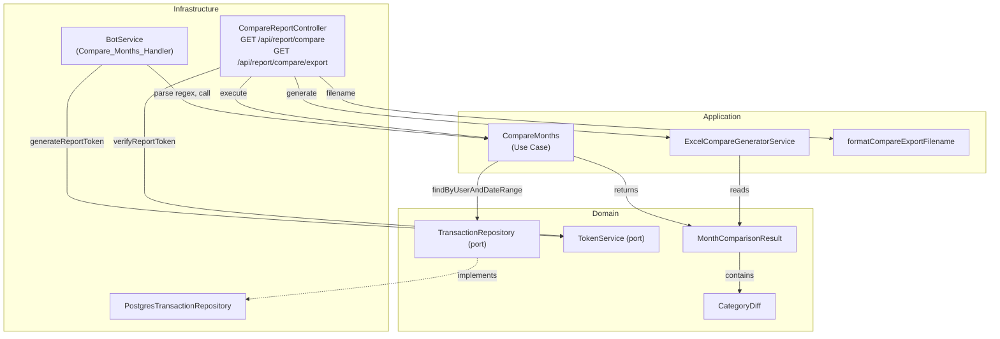

# Design Document: Month-over-Month Comparison

## Overview

This feature adds month-over-month spending comparison to the oh-my-fast-tracker bot. Users can compare expenses between any two months via Telegram bot commands ("so sánh tháng 7 với tháng 8" or "so sánh tháng" for recent months). The feature includes:

1. **Bot integration** — Regex-based command detection, comparison execution, Vietnamese-formatted reply with webview link
2. **REST API** — JSON comparison endpoint and Excel export endpoint following the TrendReportController pattern
3. **Excel export** — 3-tab workbook (comparison overview, month A details, month B details) using ExcelJS with shared styling constants

The implementation follows the existing clean architecture: domain entities/ports → application use cases/services → infrastructure controllers/channels.

## Architecture



### Request Flow

1. **Bot path**: User message → BotService regex match → `CompareMonths.execute()` → format reply + generate token → send text with webview link
2. **API JSON path**: GET `/api/report/compare?token=...&monthA=7&yearA=2025&monthB=8&yearB=2025` → verify token → `CompareMonths.execute()` → return JSON
3. **API Excel path**: GET `/api/report/compare/export?token=...&monthA=7&yearA=2025&monthB=8&yearB=2025` → verify token → `CompareMonths.execute()` → `ExcelCompareGeneratorService.generate()` → stream buffer

## Components and Interfaces

### 1. CompareMonths (Use Case)

**Location**: `src/application/usecases/CompareMonths.ts`

```typescript
export interface CompareMonthsParams {
  monthA: number;  // 1–12
  yearA: number;   // e.g. 2025
  monthB: number;  // 1–12
  yearB: number;   // e.g. 2025
}

export class SameMonthError extends Error {
  readonly code = "SAME_MONTH" as const;
  constructor() {
    super("Cannot compare a month with itself");
    this.name = "SameMonthError";
  }
}

export class InvalidMonthError extends Error {
  readonly code = "INVALID_MONTH" as const;
  constructor(month: number) {
    super(`Month ${month} is outside valid range 1-12`);
    this.name = "InvalidMonthError";
  }
}

@Injectable()
export class CompareMonths {
  constructor(
    @Inject("TransactionRepository")
    private readonly repository: TransactionRepository,
  ) {}

  async execute(userId: string, params: CompareMonthsParams): Promise<MonthComparisonResult>;
}
```

**Responsibilities**:
- Validate month range (1–12) and that months are different
- Compute date ranges for each month (first day 00:00:00 → last day 23:59:59)
- Query transactions via `TransactionRepository.findByUserAndDateRange`
- Aggregate by category (only positive amounts = expenses)
- Compute absolute difference and percentage change per category
- Return `MonthComparisonResult`

### 2. ExcelCompareGeneratorService

**Location**: `src/application/services/ExcelCompareGeneratorService.ts`

```typescript
@Injectable()
export class ExcelCompareGeneratorService {
  async generate(result: MonthComparisonResult): Promise<Buffer>;
}
```

**Responsibilities**:
- Create 3-tab ExcelJS workbook
- Tab 1 ("So sánh"): comparison overview with category diffs
- Tab 2 ("Tháng {A}"): detailed transactions for month A (same layout as ExcelTrendGeneratorService monthly tabs)
- Tab 3 ("Tháng {B}"): detailed transactions for month B
- Reuse styling constants (HEADER_FILL, ACCENT_FILL, ALTERNATING_ROW_FILL, ALL_BORDERS)
- Include "Tổng cộng" summary rows

### 3. CompareReportController

**Location**: `src/infrastructure/http/controllers/compare-report.controller.ts`

```typescript
@Controller('api/report/compare')
export class CompareReportController {
  constructor(
    private readonly compareMonths: CompareMonths,
    private readonly excelCompareGenerator: ExcelCompareGeneratorService,
    @Inject('TokenService') private readonly tokenService: TokenService,
  ) {}

  @Get()
  async getCompareReport(
    @Query('token') token?: string,
    @Query('monthA') monthAStr?: string,
    @Query('yearA') yearAStr?: string,
    @Query('monthB') monthBStr?: string,
    @Query('yearB') yearBStr?: string,
  ): Promise<MonthComparisonResult>;

  @Get('export')
  async exportCompareReport(
    @Query('token') token?: string,
    @Query('monthA') monthAStr?: string,
    @Query('yearA') yearAStr?: string,
    @Query('monthB') monthBStr?: string,
    @Query('yearB') yearBStr?: string,
    @Res() res?: Response,
  ): Promise<void>;
}
```

**Validation order** (per requirement 7.8):
1. Token verification (→ 401 INVALID_TOKEN)
2. Year presence check (→ 400 MISSING_YEAR)
3. Month range check (→ 400 INVALID_MONTH)

### 4. BotService Changes

**Location**: `src/infrastructure/channels/bot.service.ts`

Changes to existing file:
- **Import** `CompareMonths` use case
- **Update** `COMPARE_MONTHS_REGEX` to capture month numbers: `/so\s*sánh\s*tháng(?:\s+(\d{1,2})\s*(?:với|và|vs)\s*tháng\s*(\d{1,2}))?/i`
- **Add** `handleCompareMonths(userId: string, text: string)` private method
- **Replace** the current "not yet supported" block with routing to `handleCompareMonths`
- **Inject** `CompareMonths` in constructor

The handler method:
- If regex captures groups are present → explicit months mode (parse X, Y, infer years)
- If no captures (just "so sánh tháng") → default mode (current month vs previous month)
- Year inference: if month > current month → assign previous year
- Validate: same month → error reply; month outside 1–12 → error reply
- Call `CompareMonths.execute()`, format reply, generate token, append webview link

### 5. Filename Formatter

**Location**: `src/application/services/filename-formatter.ts` (append to existing file)

```typescript
/**
 * Formats the export filename for the comparison report Excel file.
 * Pattern: so-sanh-thang-{monthA}-{yearA}-vs-{monthB}-{yearB}.xlsx
 */
export function formatCompareExportFilename(
  monthA: number,
  yearA: number,
  monthB: number,
  yearB: number,
): string {
  return `so-sanh-thang-${monthA}-${yearA}-vs-${monthB}-${yearB}.xlsx`;
}
```

## Data Models

### MonthComparisonResult

**Location**: `src/domain/entities/MonthComparisonResult.ts`

```typescript
import { Transaction } from './Transaction';

export interface CategoryDiff {
  category: string;
  amountA: number;           // total in month A (0 if absent)
  amountB: number;           // total in month B (0 if absent)
  absoluteDiff: number;      // amountB - amountA
  percentChange: number | null; // null when amountA = 0 and amountB > 0 ("mới")
}

export interface MonthComparisonResult {
  userId: string;
  monthA: {
    month: number;           // 1–12
    year: number;
    label: string;           // "Tháng 7/2025"
    totalSpent: number;
    transactionCount: number;
    byCategory: Record<string, number>;
    transactions: Transaction[];
  };
  monthB: {
    month: number;
    year: number;
    label: string;
    totalSpent: number;
    transactionCount: number;
    byCategory: Record<string, number>;
    transactions: Transaction[];
  };
  totalDifference: number;       // monthB.totalSpent - monthA.totalSpent
  totalPercentChange: number | null;
  categoryDiffs: CategoryDiff[]; // sorted by |absoluteDiff| descending
  generatedAt: string;           // ISO timestamp
}
```

### Relationship to Existing Entities

- `Transaction` — reused as-is for raw data
- `MonthlyBreakdown` — NOT reused; comparison uses a simpler per-month structure (no `topCategory`, no `totalIncome` needed)
- `TokenService.ReportTokenPayload` — reused as-is for token generation (from/to as ISO strings)

## Correctness Properties

*A property is a characteristic or behavior that should hold true across all valid executions of a system — essentially, a formal statement about what the system should do. Properties serve as the bridge between human-readable specifications and machine-verifiable correctness guarantees.*

### Property 1: Category diff sum equals total difference

*For any* two sets of transactions grouped into month A and month B, the sum of all `absoluteDiff` values across all `CategoryDiff` entries SHALL equal the `totalDifference` (monthB.totalSpent − monthA.totalSpent).

**Validates: Requirements 3.4, 4.1, 4.4**

### Property 2: All categories from both months are represented

*For any* two sets of transactions (month A and month B), every category that appears in either month SHALL have a corresponding `CategoryDiff` entry in the result, and no `CategoryDiff` entry SHALL reference a category absent from both months.

**Validates: Requirements 3.3**

### Property 3: Percentage change calculation correctness

*For any* `CategoryDiff` where `amountA > 0`, the `percentChange` SHALL equal `((amountB - amountA) / amountA) * 100`. When `amountA = 0` and `amountB > 0`, `percentChange` SHALL be `null`. When `amountB = 0` and `amountA > 0`, `percentChange` SHALL equal `-100`.

**Validates: Requirements 4.1, 4.2, 4.3**

### Property 4: Only expenses are aggregated (positive amounts only)

*For any* set of transactions, the per-category totals and month totals SHALL only include transactions with `amount > 0`. Transactions with `amount <= 0` (income) SHALL NOT contribute to any spending total.

**Validates: Requirements 3.2**

### Property 5: Category diffs are sorted by absolute difference descending

*For any* `MonthComparisonResult`, the `categoryDiffs` array SHALL be sorted such that for every consecutive pair `[i, i+1]`, `|categoryDiffs[i].absoluteDiff| >= |categoryDiffs[i+1].absoluteDiff|`.

**Validates: Requirements 4.4, 5.6**

### Property 6: Year inference maps future months to previous year

*For any* month number M greater than the current month number in the current year, the year inference logic SHALL assign `currentYear - 1` to that month. For month numbers less than or equal to the current month, the year SHALL be `currentYear`.

**Validates: Requirements 1.5**

### Property 7: Comparison filename format

*For any* valid months (1–12) and years, `formatCompareExportFilename(monthA, yearA, monthB, yearB)` SHALL produce a string matching the pattern `so-sanh-thang-{monthA}-{yearA}-vs-{monthB}-{yearB}.xlsx`.

**Validates: Requirements 8.5**

### Property 8: Default month comparison resolves to current and previous month

*For any* current date, when no specific months are provided, the resolved months SHALL be the current month/year and the immediately preceding month/year (with December→January crossing years correctly).

**Validates: Requirements 2.1, 2.2**

## Error Handling

### Bot Layer (BotService)

| Condition | Response |
|-----------|----------|
| Same month specified (X = Y) | "Sếp cần chọn hai tháng khác nhau để so sánh nhé!" |
| Month outside 1–12 | "Tháng không hợp lệ, sếp nhập tháng từ 1 đến 12 nhé!" |
| Both months in the future | "Chưa có dữ liệu cho tháng trong tương lai, sếp thử so sánh các tháng đã qua nhé!" |
| Repository connection failure | "Hệ thống đang gặp sự cố tạm thời, sếp thử lại sau nhé 🙏" (reuse SERVICE_UNAVAILABLE_MSG) |
| Either month has zero transactions | Reply indicating no data: "Tháng X không có khoản chi nào để so sánh." |

### Controller Layer (CompareReportController)

| Condition | HTTP Status | Error Code |
|-----------|-------------|------------|
| Token missing or invalid | 401 | INVALID_TOKEN |
| yearA or yearB missing | 400 | MISSING_YEAR |
| monthA or monthB outside 1–12 | 400 | INVALID_MONTH |
| Same month specified | 400 | SAME_MONTH |
| Unexpected internal error | 500 | INTERNAL_ERROR |

**Validation order**: Token → yearA/yearB presence → monthA/monthB range. First failure returns immediately.

### Use Case Layer (CompareMonths)

Throws typed errors:
- `InvalidMonthError` — month < 1 or month > 12
- `SameMonthError` — monthA/yearA equals monthB/yearB

Repository errors propagate naturally (the calling layer catches them).

## Testing Strategy

### Property-Based Tests (fast-check)

Library: [fast-check](https://github.com/dubzzz/fast-check) (already compatible with Jest)

Each property test runs minimum 100 iterations with randomized inputs.

| Property | Test target | Generator strategy |
|----------|------------|-------------------|
| Property 1: Category diff sum | `CompareMonths.execute` (pure aggregation logic extracted) | Random transaction arrays with random categories and amounts |
| Property 2: All categories represented | Same | Random transactions in both months with overlapping/disjoint categories |
| Property 3: Percentage calculation | Percentage helper function | Random `amountA` (≥0) and `amountB` (≥0) pairs |
| Property 4: Only expenses aggregated | Aggregation logic | Mix of positive and negative amounts |
| Property 5: Sorted by absolute diff | Sorting logic | Random CategoryDiff arrays |
| Property 6: Year inference | Year inference helper | Random month numbers (1–12) with random "current" month |
| Property 7: Filename format | `formatCompareExportFilename` | Random months (1–12) and years (2000–2100) |
| Property 8: Default month resolution | Default month resolver | Random "today" dates across all months |

Tag format: `// Feature: month-over-month-comparison, Property {N}: {title}`

### Unit Tests (Jest)

- **CompareMonths use case**: explicit months, default recent months, January year-crossing, months with no data, edge case: both months empty
- **CompareReportController**: valid token + correct params → 200, missing token → 401, invalid token → 401, invalid month → 400, missing year → 400, internal error → 500, export returns correct headers
- **BotService handler**: regex matches for "so sánh tháng 7 với tháng 8", "so sánh tháng", "so sánh tháng 3 và tháng 5", same-month error, month-out-of-range error, connection failure message
- **ExcelCompareGeneratorService**: output buffer is valid Excel, has 3 worksheets, sheet names match, comparison tab has correct rows
- **formatCompareExportFilename**: specific examples

### Integration Tests

- End-to-end bot message flow for compare commands
- Controller API endpoints with real token generation/verification

### Non-PBT Criteria (example/integration tests only)

- Requirement 5 (message formatting): example-based tests with known inputs → expected formatted strings
- Requirement 9 (Excel tabs): example-based tests verifying tab count, names, and cell content
- Requirement 10 (webview link): example test verifying URL pattern
- Requirement 11 (README update): manual verification
- Requirement 12 (/help update): example test checking HELP_MSG content
- Requirement 13 (existing tests pass): CI pipeline validation
