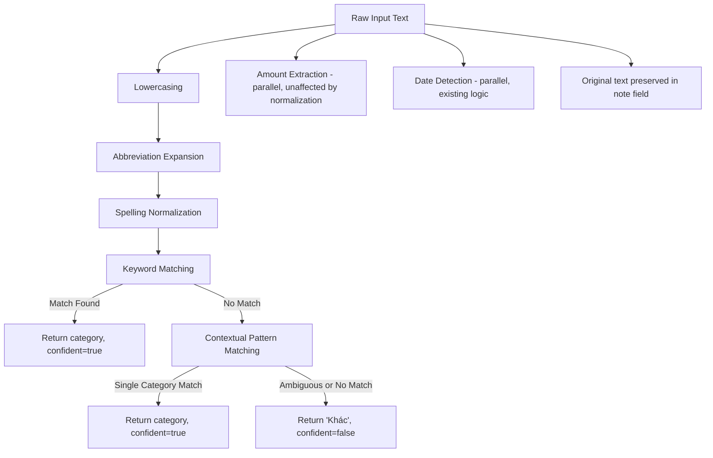
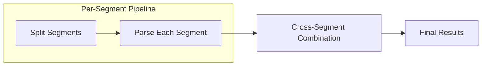

# Design Document: Regex Parser Enhancement

## Overview

This design enhances the `RegexParser` to handle a broader range of Vietnamese expense messages confidently, reducing costly escalations to the Gemini Flash AI parser. The core strategy is a **preprocessing pipeline** that normalizes informal text before keyword matching, plus expanded keyword coverage and contextual heuristics.

The current `RegexParser` operates as a single-pass keyword matcher with ~100 keywords across 14 categories. When it cannot confidently categorize a segment, the `HybridParser` escalates the entire message to AI. This enhancement adds three preprocessing stages (abbreviation expansion, spelling normalization, contextual matching) and expands keyword coverage to intercept more messages before AI escalation.

**Key Design Goals:**
- Reduce AI escalations by 40-60% through expanded local parsing
- Maintain zero-regression on existing confident parses
- Keep parsing latency under 5ms per message (pure regex/string ops)
- Preserve the original message text in the `note` field

## Architecture

The enhanced `RegexParser` uses a pipeline architecture where each stage transforms the text progressively before keyword matching. The pipeline is additive — each stage can only *increase* confidence, never decrease it.



**Cross-Segment Combination** runs as a post-processing step after all segments are individually parsed, linking keyword-bearing segments (without amounts) to adjacent amount-bearing segments (with spending-verb connectors).



## Components and Interfaces

### Modified Files

| File | Changes |
|------|---------|
| `src/infrastructure/parsers/RegexParser.ts` | Add preprocessing pipeline, expand keywords, add contextual patterns, add cross-segment logic |
| `src/infrastructure/parsers/HybridParser.ts` | No changes needed — relies on existing `confident` flag |

### New Internal Components (within RegexParser.ts)

#### 1. `ABBREVIATION_MAP`

A constant mapping of abbreviations to their expanded forms:

```typescript
const ABBREVIATION_MAP: Record<string, string> = {
  cf: "cà phê",
  cp: "cà phê",
  dt: "điện thoại",
  bv: "bệnh viện",
  st: "siêu thị",
  ks: "khách sạn",
  nt: "nhà thuốc",
};
```

#### 2. `expandAbbreviations(text: string): string`

Replaces standalone abbreviation tokens (word-boundary delimited) with their full forms. Case-insensitive matching. Returns the transformed text for downstream keyword matching.

#### 3. `normalizeSpelling(text: string): string`

Applies word-initial consonant substitutions:
- `f` → `ph` (e.g., "fở" → "phở")
- `z` → `gi` (e.g., "zải trí" → "giải trí")
- `w` → `qu` (e.g., "wần áo" → "quần áo")
- `d` → `gi` (conditional — only when result matches a known keyword)

Only applies at word boundaries. Returns transformed text.

#### 4. `CONTEXTUAL_PATTERNS`

Emoji/symbol-to-category mapping for contextual confidence:

```typescript
const CONTEXTUAL_PATTERNS: [string, string[]][] = [
  ["Ăn uống", ["🍜", "🍚", "🥗", "🍺", "🍻", "🍕", "🍔", "☕", "🧋", "🍲"]],
  ["Di chuyển", ["⛽", "🚗", "🚕", "🏍", "🚌", "✈️", "🚂"]],
  ["Mua sắm", ["🛍", "👗", "👟", "🎒", "💄"]],
  ["Giải trí", ["🎬", "🎮", "🎵", "🎤", "🎭"]],
  ["Sức khỏe", ["💊", "🏥", "🩺", "💉"]],
  ["Giáo dục", ["📚", "✏️", "🎓"]],
  ["Con cái", ["👶", "🍼", "🧒"]],
];
```

#### 5. `detectContextualCategory(text: string): string | null`

Scans for emoji/symbol matches. Returns category only if exactly one category matches; returns `null` if zero or multiple categories match (ambiguity → escalate).

#### 6. `CROSS_SEGMENT_CONNECTORS`

```typescript
const CROSS_SEGMENT_CONNECTORS = ["hết", "tốn", "mất", "trả", "chi", "xài", "tiêu"];
```

#### 7. `combineAdjacentSegments(segments: ParsedSegment[]): ParsedExpense[]`

Post-processing step that links keyword-bearing segments (no amount) with adjacent amount-bearing segments (with connector verb). Max 1 look-ahead.

### Public Interface (unchanged)

```typescript
@Injectable()
export class RegexParser implements Parser {
  parse(text: string): ParsedExpense[];
  parseWithConfidence(text: string): (ParsedExpense & { confident: boolean })[];
}
```

The `ParsedExpense` interface remains unchanged:
```typescript
interface ParsedExpense {
  amount: number;
  category: string;
  note: string;
  date?: Date;
}
```

## Data Models

### Internal Processing Types

```typescript
/** Intermediate result during per-segment parsing */
interface SegmentParseResult {
  originalText: string;       // Raw segment text (preserved for note field)
  normalizedText: string;     // After abbreviation + spelling normalization
  amount: number | null;      // Extracted from originalText (normalization doesn't affect this)
  category: string;           // Detected category or "Khác"
  confident: boolean;         // Whether category was confidently assigned
  date?: Date;                // Detected relative date
  hasKeyword: boolean;        // Whether a keyword was matched (for cross-segment logic)
  hasConnector: boolean;      // Whether a connector verb is present (for cross-segment logic)
}
```

### Expanded CATEGORY_KEYWORDS

New keywords to be added (minimum 15 across 5+ categories):

| Category | New Keywords |
|----------|-------------|
| Ăn uống | "trà", "nước", "chè", "bữa", "ăn chiều", "bữa sáng", "bữa trưa", "bữa tối" |
| Di chuyển | "gojek", "be", "đi xe", "toll", "phí cầu đường", "vé tàu" |
| Mua sắm | "tiki", "online", "order", "đặt hàng" |
| Sức khỏe | "gym", "yoga", "thể dục", "phòng tập" |
| Giải trí | "nhạc", "show", "vé", "billiard", "bida" |
| Nhà ở | "sửa nhà", "đồ gia dụng", "nội thất" |
| Internet | "mobile", "gói cước" |
| Giáo dục | "udemy", "coursera", "online course" |

### English Keywords (integrated into CATEGORY_KEYWORDS)

English keywords will be added to the appropriate position in the existing `CATEGORY_KEYWORDS` array to share the same priority logic:

```typescript
// Added to existing categories:
["Ăn uống", [...existingKeywords, "coffee", "lunch", "dinner", "breakfast"]],
["Sức khỏe", [...existingKeywords, "gym"]],
["Di chuyển", [...existingKeywords, "parking", "uber"]],
["Nhà ở", [...existingKeywords, "rent"]],
["Mua sắm", [...existingKeywords, "shopping"]],
["Giải trí", [...existingKeywords, "movie"]],
["Tiện ích", [...existingKeywords, "electric", "water"]],
```

Note: "gas", "taxi", and "coffee" are already present in the current keyword map.

## Correctness Properties

*A property is a characteristic or behavior that should hold true across all valid executions of a system — essentially, a formal statement about what the system should do. Properties serve as the bridge between human-readable specifications and machine-verifiable correctness guarantees.*

### Property 1: Keyword Match Guarantees Confidence

*For any* message segment containing a recognized keyword (from the expanded CATEGORY_KEYWORDS map) and a valid amount, the RegexParser SHALL return `confident: true` and assign the category associated with that keyword.

**Validates: Requirements 1.1, 1.5**

### Property 2: Category Priority Ordering

*For any* message segment containing keywords from two or more different categories, the RegexParser SHALL assign the category whose entry appears first (earliest index) in the CATEGORY_KEYWORDS array.

**Validates: Requirements 1.3, 8.5**

### Property 3: Longest Keyword Match

*For any* message segment containing two keywords where one is a substring of the other (both within the same or different categories), the RegexParser SHALL match the longer keyword first.

**Validates: Requirements 1.4, 8.6**

### Property 4: Abbreviation Expansion Round-Trip

*For any* recognized abbreviation appearing as a standalone word in a message with a valid amount, the RegexParser SHALL produce the same category and confidence as if the full expanded form were written in place of the abbreviation, regardless of input casing.

**Validates: Requirements 2.1, 2.4, 2.5**

### Property 5: Abbreviation Word-Boundary Safety

*For any* string where a recognized abbreviation appears as a substring within a longer non-whitespace token, the RegexParser SHALL NOT expand that abbreviation, and the parsing result SHALL be identical to parsing the unmodified text without abbreviation expansion.

**Validates: Requirements 2.3**

### Property 6: Spelling Normalization Enables Keyword Match

*For any* message segment where applying word-initial consonant normalization (f→ph, z→gi, w→qu) transforms the text to contain a recognized keyword, the RegexParser SHALL assign the corresponding category with `confident: true`.

**Validates: Requirements 3.1, 3.4**

### Property 7: Normalization Word-Boundary Safety

*For any* word where the normalizable character (f, z, w) appears at a non-initial position, the RegexParser SHALL NOT apply normalization to that character, leaving the word unchanged.

**Validates: Requirements 3.3**

### Property 8: Normalization Graceful Fallback

*For any* message where spelling normalization does NOT produce a recognized keyword match, the RegexParser SHALL produce the same category and confidence result as parsing the original unnormalized text.

**Validates: Requirements 3.5**

### Property 9: Original Text Preservation in Note Field

*For any* input message, regardless of whether abbreviation expansion or spelling normalization was applied internally, the `note` field of each returned `ParsedExpense` SHALL contain the original segment text exactly as typed by the user (trimmed but not normalized).

**Validates: Requirements 3.6, 7.2**

### Property 10: Contextual Indicator Confidence (Single-Category)

*For any* message segment containing a valid amount and at least one contextual indicator (emoji) that maps to exactly one category, and containing no keyword match, the RegexParser SHALL assign that category with `confident: true`.

**Validates: Requirements 4.1**

### Property 11: Amount-Only Segments Default to Uncertain

*For any* message segment containing only a valid amount and no recognized keyword, abbreviation, normalized keyword, or contextual indicator, the RegexParser SHALL assign category "Khác" with `confident: false`.

**Validates: Requirements 4.3, 4.4**

### Property 12: Ambiguous Context Escalates

*For any* message segment containing contextual indicators (emojis) that map to two or more different categories and no keyword match, the RegexParser SHALL assign "Khác" with `confident: false`.

**Validates: Requirements 4.5**

### Property 13: Keyword Priority Over Contextual Patterns

*For any* message segment that matches both an exact keyword for category A and a contextual indicator for category B, the RegexParser SHALL assign category A (the keyword's category).

**Validates: Requirements 4.6**

### Property 14: Vietnamese Keyword Priority Over English

*For any* message segment containing both a Vietnamese keyword (mapping to category A) and an English keyword (mapping to category B where A ≠ B), the RegexParser SHALL assign category A because Vietnamese keywords have higher priority in the CATEGORY_KEYWORDS ordering.

**Validates: Requirements 5.3**

### Property 15: Cross-Segment Combination With Connector

*For any* pair of adjacent segments where (1) the first segment contains a category keyword but no amount, and (2) the second segment contains a valid amount and a recognized cross-segment connector verb, the RegexParser SHALL produce a single `ParsedExpense` with the first segment's category, the second segment's amount, and `confident: true`.

**Validates: Requirements 6.1, 6.3**

### Property 16: Amount-First Order Independence

*For any* valid keyword and amount appearing together in a single segment, the RegexParser SHALL produce the same category and confidence regardless of whether the amount precedes the keyword or the keyword precedes the amount.

**Validates: Requirements 6.4**

### Property 17: No Connector Prevents Combination

*For any* pair of adjacent segments where one has a keyword (no amount) and the other has an amount (no keyword) but no recognized connector verb, the RegexParser SHALL NOT combine them — the amount segment SHALL be categorized as "Khác" with `confident: false`.

**Validates: Requirements 6.5**

### Property 18: Normalization Does Not Affect Amount Extraction

*For any* input text, the amount extracted by the RegexParser SHALL be identical whether parsing the original text or the post-normalization/expansion text. Amount extraction is independent of the text normalization pipeline.

**Validates: Requirements 7.1, 7.3**

### Property 19: Backward Compatibility — Amount Preservation

*For any* message that the current RegexParser successfully parses (amount > 0), the enhanced RegexParser SHALL produce the same numeric amount. If the current parser assigned the category with `confident: true`, the enhanced parser SHALL assign the same category.

**Validates: Requirements 8.2, 8.3**

## Error Handling

### Pipeline Failure Modes

| Scenario | Handling |
|----------|----------|
| Abbreviation expansion produces invalid text | Fall through to keyword matching on original text |
| Normalization produces ambiguous match | Use original text for matching (graceful fallback) |
| Cross-segment combination finds no connector | Treat segments independently (no combination) |
| Emoji/contextual match is ambiguous (multi-category) | Assign "Khác" with `confident: false` (escalate to AI) |
| Empty or whitespace-only input | Return empty array (existing behavior) |
| Amount extraction fails (no valid amount) | Skip segment (existing behavior) |

### Design Principle: Fail Open to AI

The enhancement follows a "fail open" principle — when in doubt, the parser assigns `confident: false` which triggers AI escalation via `HybridParser`. This ensures:
- No false positives (wrong category assigned with confidence)
- AI catches genuinely ambiguous cases
- New features can only *increase* the set of confidently-handled messages

## Testing Strategy

### Property-Based Testing with fast-check

This feature is highly suitable for property-based testing because:
- The parser is a **pure function** with clear input/output behavior
- There are **universal properties** (keyword → category, normalization round-trips)
- The input space is large (Vietnamese text with various spellings, abbreviations, amounts)
- **Round-trip properties** naturally validate parsing consistency

**Library**: [fast-check](https://github.com/dubzzz/fast-check) (TypeScript PBT library)

**Configuration**:
- Minimum 100 iterations per property test (fast-check default: 100)
- Each property test tagged with: `// Feature: regex-parser-enhancement, Property {N}: {title}`

**Test File**: `test/parsers/regex-parser-pbt.spec.ts`

### Custom Generators

The property tests require custom fast-check arbitraries:

```typescript
// Generate a random keyword from the expanded CATEGORY_KEYWORDS map
const arbKeyword: fc.Arbitrary<{ keyword: string; category: string }>;

// Generate a valid amount string (e.g., "50k", "1tr", "2 củ")
const arbAmountStr: fc.Arbitrary<{ text: string; value: number }>;

// Generate a recognized abbreviation
const arbAbbreviation: fc.Arbitrary<{ abbrev: string; expanded: string }>;

// Generate an emoji from CONTEXTUAL_PATTERNS
const arbEmoji: fc.Arbitrary<{ emoji: string; category: string }>;

// Generate informal spelling (f-initial, z-initial, w-initial words)
const arbInformalSpelling: fc.Arbitrary<{ informal: string; normalized: string }>;
```

### Unit Testing (Example-Based)

Existing tests in `test/parsers/regex-parser.spec.ts` serve as regression tests (Requirement 8.1). New example-based tests should cover:

- Each specific abbreviation mapping (Requirement 2.2)
- Each specific normalization rule (Requirement 3.2)
- Specific English keyword mappings (Requirement 5.2)
- Cross-segment connector verb list (Requirement 6.2)
- Multi-keyword look-ahead boundary (Requirement 6.6)
- Category priority order verification (Requirement 8.5)

### Test Organization

```
test/parsers/
├── regex-parser.spec.ts          # Existing regression tests (unchanged)
├── regex-parser-pbt.spec.ts      # Property-based tests (new, fast-check)
├── regex-parser-abbrev.spec.ts   # Abbreviation expansion examples (new)
├── regex-parser-normalize.spec.ts # Spelling normalization examples (new)
└── regex-parser-compound.spec.ts  # Cross-segment combination examples (new)
```

### Dependency Addition

```json
// devDependencies addition:
"fast-check": "^3.22.0"
```
