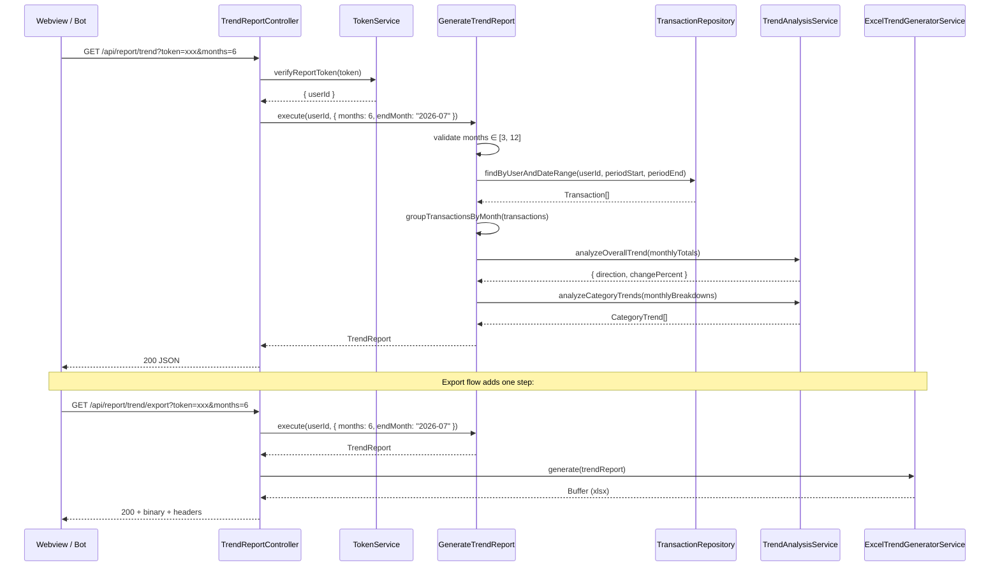
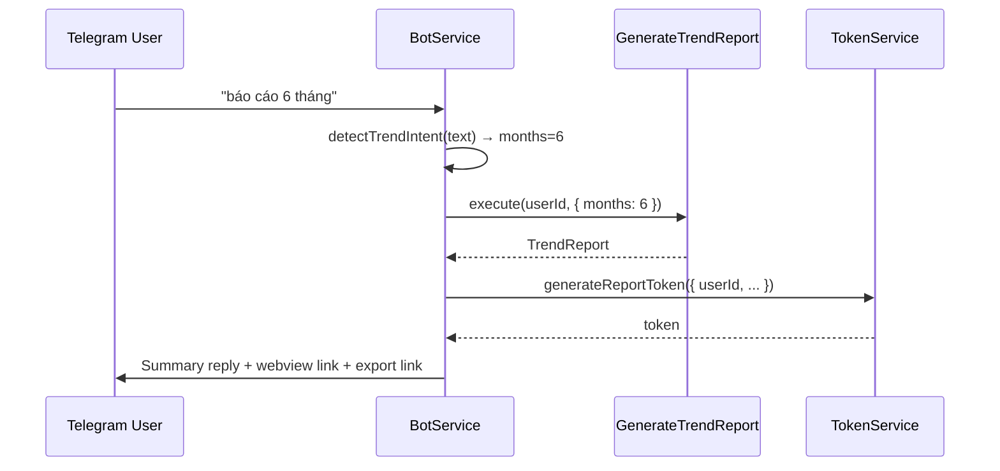

# Design Document: Multi-Month Trend Report

## Overview

This feature introduces a fully independent Trend Report subsystem that analyzes spending patterns across 3–12 months. It produces a `TrendReport` object containing monthly breakdowns, overall trend direction, and per-category trend analysis. The data can be consumed via JSON API, exported as a multi-tab Excel file, or summarized via Telegram bot.

The design follows the existing Clean Architecture layers with complete isolation from `GenerateWeeklyReport` and `ExcelGeneratorService`:

- **Domain** — New entities: `MonthlyBreakdown`, `CategoryTrend`, `TrendReport`
- **Application** — New use case `GenerateTrendReport`, new services `TrendAnalysisService` and `ExcelTrendGeneratorService`
- **Infrastructure (HTTP)** — New `TrendReportController` with `/api/report/trend` and `/api/report/trend/export` endpoints
- **Infrastructure (Channels)** — Extended `BotService` with new routing for trend commands

### Key Design Decisions

1. **Separate use case** rather than extending `GenerateWeeklyReport`: The two answer fundamentally different questions (single aggregate vs time-series analysis). Coupling them would create a god-class.
2. **Half-period comparison algorithm** over linear regression: With only 3–12 data points, regression is overkill and harder to explain to users. The split-average approach is intuitive and robust.
3. **Single query + app-layer grouping**: Fetch all transactions once for the full period, then group by month in memory. This avoids N+1 queries and leverages the existing `(user_id, spent_at)` index.
4. **Reuse shared utilities**: `vnd-formatter.ts` and `filename-formatter.ts` are extended (not modified) to cover trend report naming. The `TransactionRepository` port is reused directly.

## Architecture



### Telegram Bot Flow



## Components and Interfaces

### GenerateTrendReport (Use Case)

**Path:** `src/application/usecases/GenerateTrendReport.ts`

```typescript
export interface TrendReportParams {
  months: number;       // 3–12, default 6
  endMonth?: string;    // "YYYY-MM", default current month
}

@Injectable()
export class GenerateTrendReport {
  constructor(
    @Inject("TransactionRepository") private readonly repository: TransactionRepository,
    private readonly trendAnalysis: TrendAnalysisService,
  ) {}

  async execute(userId: string, params: TrendReportParams): Promise<TrendReport>;
}
```

Responsibilities:
- Validate `months` ∈ [3, 12] (throw typed error if not)
- Compute `periodStart` and `periodEnd` from `months` and `endMonth`
- Fetch all transactions in range via single repository call
- Group transactions by calendar month
- Build `MonthlyBreakdown[]` (including empty months with zeros)
- Delegate trend calculations to `TrendAnalysisService`
- Assemble and return complete `TrendReport`

### TrendAnalysisService

**Path:** `src/application/services/TrendAnalysisService.ts`

```typescript
@Injectable()
export class TrendAnalysisService {
  analyzeOverallTrend(monthlyTotals: number[]): {
    direction: 'increasing' | 'decreasing' | 'stable';
    changePercent: number;
  };

  analyzeCategoryTrends(
    monthlyBreakdowns: MonthlyBreakdown[],
    minMonthsPresence?: number,  // default 3
  ): CategoryTrend[];

  getTopGrowing(trends: CategoryTrend[], limit?: number): CategoryTrend[];
  getTopShrinking(trends: CategoryTrend[], limit?: number): CategoryTrend[];
}
```

Responsibilities:
- Implement half-period comparison algorithm (split months into two halves, compare averages)
- Handle odd month count by excluding middle month
- Handle edge cases: all zeros (stable), first half zero + second half > 0 (increasing, 100%)
- Filter categories by minimum presence threshold (≥3 months)
- Fill missing months with 0 in `monthlyAmounts` arrays
- Sort and select top 3 growing/shrinking categories

### ExcelTrendGeneratorService

**Path:** `src/application/services/ExcelTrendGeneratorService.ts`

```typescript
@Injectable()
export class ExcelTrendGeneratorService {
  async generate(report: TrendReport): Promise<Buffer>;
}
```

Responsibilities:
- Create workbook with N+1 tabs (Overview + N monthly detail tabs)
- **Overview tab**: Header, summary stats table, top growing/shrinking category tables
- **Monthly tabs** (named `T{M}-{YYYY}`): Pie chart placeholder, category breakdown table, transaction detail table with alternating rows
- Reuse styling constants (HEADER_FILL, ACCENT_FILL, ALTERNATING_ROW_FILL, ALL_BORDERS) from ExcelGeneratorService patterns
- Apply VND formatting via `vnd-formatter.ts`
- Respect Excel 31-char sheet name limit and forbidden characters

### TrendReportController

**Path:** `src/infrastructure/http/controllers/trend-report.controller.ts`

```typescript
@Controller("api/report/trend")
export class TrendReportController {
  constructor(
    private readonly generateTrendReport: GenerateTrendReport,
    private readonly excelTrendGenerator: ExcelTrendGeneratorService,
    @Inject("TokenService") private readonly tokenService: TokenService,
  ) {}

  @Get()
  async getTrendReport(
    @Query("token") token?: string,
    @Query("months") months?: string,
    @Query("endMonth") endMonth?: string,
  ): Promise<TrendReport>;

  @Get("export")
  async exportTrendReport(
    @Query("token") token?: string,
    @Query("months") months?: string,
    @Query("endMonth") endMonth?: string,
    @Res() res?: Response,
  ): Promise<void>;
}
```

Responsibilities:
- Parse and validate query parameters
- Verify JWT token (401 if invalid)
- Delegate months validation to use case (400 responses based on use case errors)
- Return JSON for `/trend`, binary xlsx for `/trend/export`
- Set appropriate response headers for export
- Handle errors consistently (see Error Handling section)

### BotService Extensions

**Path:** `src/infrastructure/channels/bot.service.ts` (extended, not replaced)

New routing logic added BEFORE the existing `REPORT_REGEX` check:

```typescript
// New regex patterns (evaluated first)
const TREND_REPORT_REGEX = /(?:báo\s*cáo|xu\s*hướng)\s*(?:chi\s*tiêu\s*)?(\d+)?\s*tháng|báo\s*cáo\s*xu\s*hướng/i;
const COMPARE_MONTHS_REGEX = /so\s*sánh\s*tháng\s*\d+\s*(?:với|và|vs)\s*tháng\s*\d+/i;
```

New methods:
- `detectTrendIntent(text: string): { isTrend: boolean; months?: number }` — returns parsed months or undefined for default
- `handleTrendReportRequest(userId: string, months: number): Promise<void>` — generates trend report and sends summary
- `handleCompareMonthsRequest(userId: string): Promise<void>` — replies with "not yet supported"

## Data Models

### MonthlyBreakdown (New Entity)

**Path:** `src/domain/entities/MonthlyBreakdown.ts`

```typescript
export interface MonthlyBreakdown {
  month: string;                              // "2026-02" (YYYY-MM)
  monthLabel: string;                         // "Tháng 2/2026"
  totalSpent: number;
  totalIncome: number;
  transactionCount: number;
  byCategory: Record<string, number>;         // category name → total amount
  topCategory: { name: string; amount: number } | null;
}
```

### CategoryTrend (New Entity)

**Path:** `src/domain/entities/CategoryTrend.ts`

```typescript
export interface CategoryTrend {
  category: string;
  monthlyAmounts: number[];                   // length = months count, chronological order
  changePercent: number;                      // (avgSecondHalf - avgFirstHalf) / avgFirstHalf * 100
  direction: 'increasing' | 'decreasing' | 'stable';
  averageMonthly: number;
}
```

### TrendReport (New Entity)

**Path:** `src/domain/entities/TrendReport.ts`

```typescript
export interface TrendReport {
  userId: string;
  periodStart: string;                        // "2026-02-01" (ISO date)
  periodEnd: string;                          // "2026-07-31" (ISO date)
  monthsCount: number;

  overview: {
    totalSpent: number;
    averageMonthlySpent: number;
    highestMonth: { month: string; amount: number };
    lowestMonth: { month: string; amount: number };
    overallDirection: 'increasing' | 'decreasing' | 'stable';
    overallChangePercent: number;
    hasIncompleteData: boolean;
    monthsWithData: number;
  };

  monthlyBreakdown: MonthlyBreakdown[];       // sorted ascending by time
  categoryTrends: CategoryTrend[];            // sorted by |changePercent| descending
  topGrowingCategories: CategoryTrend[];      // top 3 increasing
  topShrinkingCategories: CategoryTrend[];    // top 3 decreasing

  generatedAt: string;                        // ISO timestamp
}
```

### Validation Error Types

```typescript
export class MonthsBelowMinimumError extends Error {
  readonly code = "MONTHS_BELOW_MINIMUM";
  readonly min = 3;
}

export class MonthsLimitExceededError extends Error {
  readonly code = "MONTHS_LIMIT_EXCEEDED";
  readonly max = 12;
}
```

## Correctness Properties

### Property 1: Monthly Breakdown Completeness

*For any* valid `months` parameter N ∈ [3, 12] and any set of transactions (including empty), the returned `monthlyBreakdown` array SHALL have exactly N elements, each corresponding to a unique calendar month in the requested period, sorted in ascending chronological order.

**Validates: Requirements 3.1, 3.3**

### Property 2: Half-Period Comparison Symmetry

*For any* array of N monthly totals where N ≥ 3:
- If N is even: firstHalf = months[0..N/2-1], secondHalf = months[N/2..N-1], each half has N/2 elements
- If N is odd: firstHalf = months[0..floor(N/2)-1], secondHalf = months[ceil(N/2)..N-1], middle month excluded, each half has floor(N/2) elements
- No month appears in both halves, and the middle month (if N is odd) appears in neither

**Validates: Requirements 4.1, 4.5**

### Property 3: Direction Classification Consistency

*For any* computed `changePercent`:
- `changePercent > 10` → direction is `"increasing"`
- `changePercent < -10` → direction is `"decreasing"`
- `-10 ≤ changePercent ≤ 10` → direction is `"stable"`

This property holds for both `overallDirection` and each `CategoryTrend.direction`.

**Validates: Requirements 4.2, 4.3, 4.4, 5.4**

### Property 4: Category Trend Eligibility

*For any* category in `categoryTrends`, that category SHALL appear with a non-zero amount in at least 3 of the N months in `monthlyBreakdown`. Conversely, *for any* category appearing in fewer than 3 months, it SHALL NOT be present in `categoryTrends`, `topGrowingCategories`, or `topShrinkingCategories`.

**Validates: Requirements 5.1, 5.2**

### Property 5: Monthly Amounts Array Length

*For any* `CategoryTrend` in the result, `monthlyAmounts.length` SHALL equal `monthsCount`. Months where the category has no transactions SHALL have value `0` at the corresponding index.

**Validates: Requirements 5.3**

### Property 6: Top Categories Ordering and Bounds

*For any* `topGrowingCategories` array:
- Length ≤ 3
- All elements have `direction === "increasing"`
- Sorted by `changePercent` in descending order

*For any* `topShrinkingCategories` array:
- Length ≤ 3
- All elements have `direction === "decreasing"`
- Sorted by `changePercent` in ascending order (most negative first)

**Validates: Requirements 5.5, 5.6, 5.7**

### Property 7: Months Validation Invariant

*For any* call to `GenerateTrendReport.execute()` with `months` outside [3, 12], the use case SHALL throw an error BEFORE any database query is executed. The error type SHALL distinguish between below-minimum and above-maximum cases.

**Validates: Requirements 6.1, 6.2, 6.3, 6.4**

### Property 8: Incomplete Data Detection

*For any* `TrendReport`:
- `overview.hasIncompleteData === true` if and only if at least one element in `monthlyBreakdown` has `transactionCount === 0`
- `overview.monthsWithData` equals the count of elements in `monthlyBreakdown` where `transactionCount > 0`
- `overview.monthsWithData` is always ≤ `monthsCount`

**Validates: Requirements 7.1, 7.2, 7.3**

### Property 9: Excel Tab Count and Naming

*For any* generated Excel workbook from a TrendReport with `monthsCount = N`:
- The workbook SHALL contain exactly N + 1 worksheets
- The first worksheet SHALL be named "Tổng quan"
- Subsequent worksheets SHALL be named `T{M}-{YYYY}` in chronological order
- No sheet name exceeds 31 characters or contains `/ \ ? * [ ] :`

**Validates: Requirements 8.1, 8.2, 8.3, 8.7**

### Property 10: Zero Division Safety

*For any* set of monthly totals where the first half average is 0:
- If second half average is also 0: `changePercent = 0`, `direction = "stable"`
- If second half average > 0: `changePercent = 100`, `direction = "increasing"`

This prevents division-by-zero errors in the half-period comparison algorithm.

**Validates: Requirements 4.6, 4.7**

### Property 11: Single Query Guarantee

*For any* call to `GenerateTrendReport.execute()`, the `TransactionRepository.findByUserAndDateRange()` method SHALL be called exactly once (verified in tests via mock call count).

**Validates: Requirements 10.1, 10.2**

## Error Handling

| Scenario | HTTP Status | Response Body | Source |
|----------|-------------|---------------|--------|
| Missing or invalid/expired token | 401 | `{ "error": "INVALID_TOKEN" }` | Controller |
| `months` < 3 | 400 | `{ "error": "MONTHS_BELOW_MINIMUM", "min": 3 }` | Use case → Controller |
| `months` > 12 | 400 | `{ "error": "MONTHS_LIMIT_EXCEEDED", "max": 12 }` | Use case → Controller |
| User has no transactions | 200 | Valid `TrendReport` with zeros | Use case (not an error) |
| Unexpected error | 500 | `{ "error": "INTERNAL_ERROR" }` | Controller catch-all |

The controller maps use case error types to HTTP responses:
- `MonthsBelowMinimumError` → 400
- `MonthsLimitExceededError` → 400
- Token verification failure → 401
- All other exceptions → 500 with NestJS Logger.error()

## Testing Strategy

### Unit Tests (TrendAnalysisService)

Pure logic, no DB dependency — ideal for thorough unit testing:

| Test | Covers |
|------|--------|
| 6 months increasing trend (avg second half > first half by >10%) | Property 3 |
| 6 months decreasing trend | Property 3 |
| 6 months stable trend (within ±10%) | Property 3 |
| Odd month count (7 months) — middle excluded | Property 2 |
| All zeros → stable, 0% | Property 10 |
| First half zeros, second half > 0 → increasing, 100% | Property 10 |
| Category with presence < 3 months excluded from trends | Property 4 |
| Category monthlyAmounts always has N elements | Property 5 |
| Top growing/shrinking limited to 3, correctly sorted | Property 6 |

### Unit Tests (GenerateTrendReport)

| Test | Covers |
|------|--------|
| months=2 throws MonthsBelowMinimumError | Property 7 |
| months=13 throws MonthsLimitExceededError | Property 7 |
| monthlyBreakdown has exactly N elements | Property 1 |
| Empty months have transactionCount=0, totalSpent=0 | Property 1 |
| hasIncompleteData true when any month is empty | Property 8 |
| Repository called exactly once | Property 11 |

### Unit Tests (TrendReportController)

| Test | Covers |
|------|--------|
| Valid request returns 200 with TrendReport JSON | Req 1.1 |
| Missing token returns 401 | Req 1.4 |
| Invalid token returns 401 | Req 1.4 |
| months < 3 returns 400 with MONTHS_BELOW_MINIMUM | Req 1.5 |
| months > 12 returns 400 with MONTHS_LIMIT_EXCEEDED | Req 1.6 |
| Export returns xlsx with correct headers | Req 2.1, 2.2, 2.3 |

### Unit Tests (ExcelTrendGeneratorService)

| Test | Covers |
|------|--------|
| Workbook has N+1 sheets | Property 9 |
| Sheet names follow T{M}-{YYYY} format | Property 9 |
| Overview tab contains summary statistics | Req 8.4 |
| Monthly tabs contain transaction tables | Req 8.5 |

### Unit Tests (BotService — trend routing)

| Test | Covers |
|------|--------|
| "báo cáo 6 tháng" triggers trend report | Req 9.1 |
| "xu hướng chi tiêu 3 tháng" triggers trend with months=3 | Req 9.1 |
| "báo cáo xu hướng" defaults to 6 months | Req 9.1 |
| "báo cáo 2 tháng" replies with range error, no use case call | Req 9.5 |
| "so sánh tháng 1 với tháng 6" replies unsupported | Req 9.6 |
| "báo cáo tháng này" still routes to existing handler | Req 9.2 |

### File Organization

```
src/
  domain/
    entities/
      MonthlyBreakdown.ts          [NEW]
      CategoryTrend.ts             [NEW]
      TrendReport.ts               [NEW]
  application/
    usecases/
      GenerateTrendReport.ts       [NEW]
    services/
      TrendAnalysisService.ts      [NEW]
      ExcelTrendGeneratorService.ts [NEW]
      filename-formatter.ts        [EXTENDED — add trend report filename format]
  infrastructure/
    http/
      controllers/
        trend-report.controller.ts [NEW]
      http.module.ts               [UPDATED — register TrendReportController]
    channels/
      bot.service.ts               [UPDATED — add trend routing before report routing]
  application/
    application.module.ts          [UPDATED — register new services]
test/
  services/
    trend-analysis.spec.ts         [NEW]
    excel-trend-generator.spec.ts  [NEW]
  usecases/
    generate-trend-report.spec.ts  [NEW]
  controllers/
    trend-report-controller.spec.ts [NEW]
  channels/
    bot-trend-routing.spec.ts      [NEW]
```
