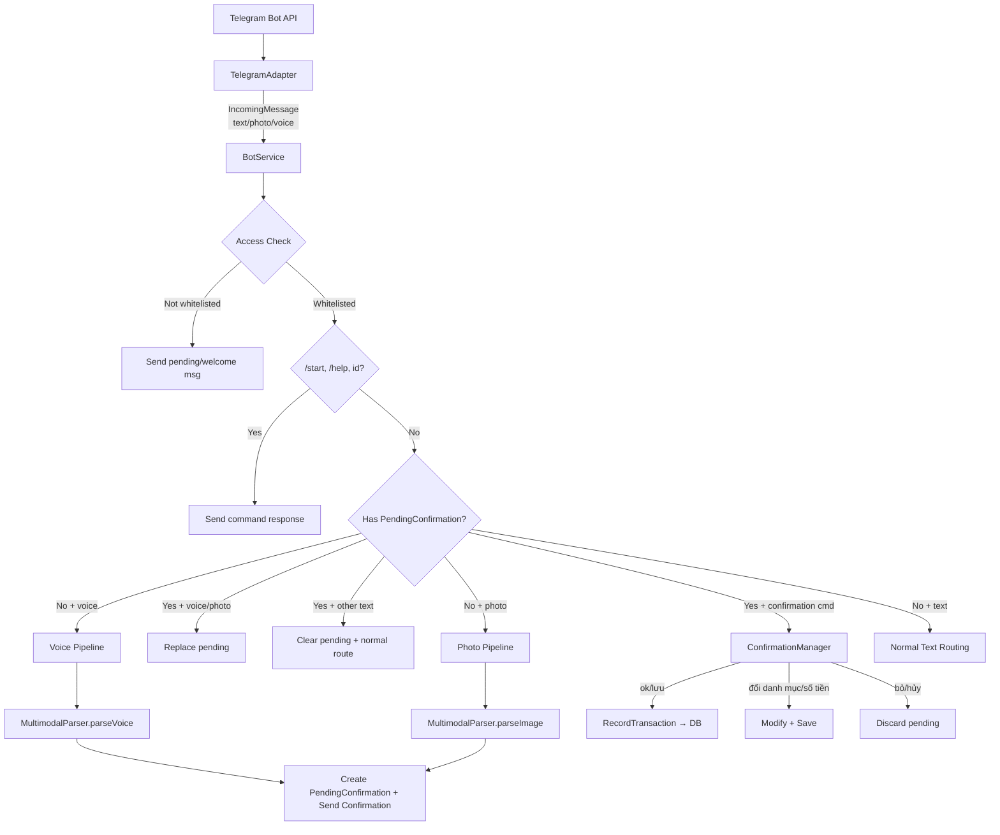
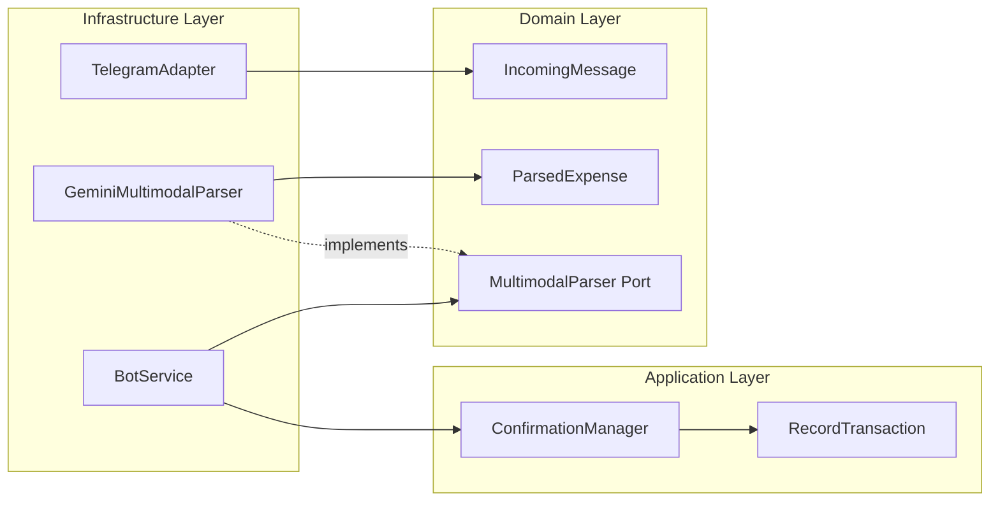
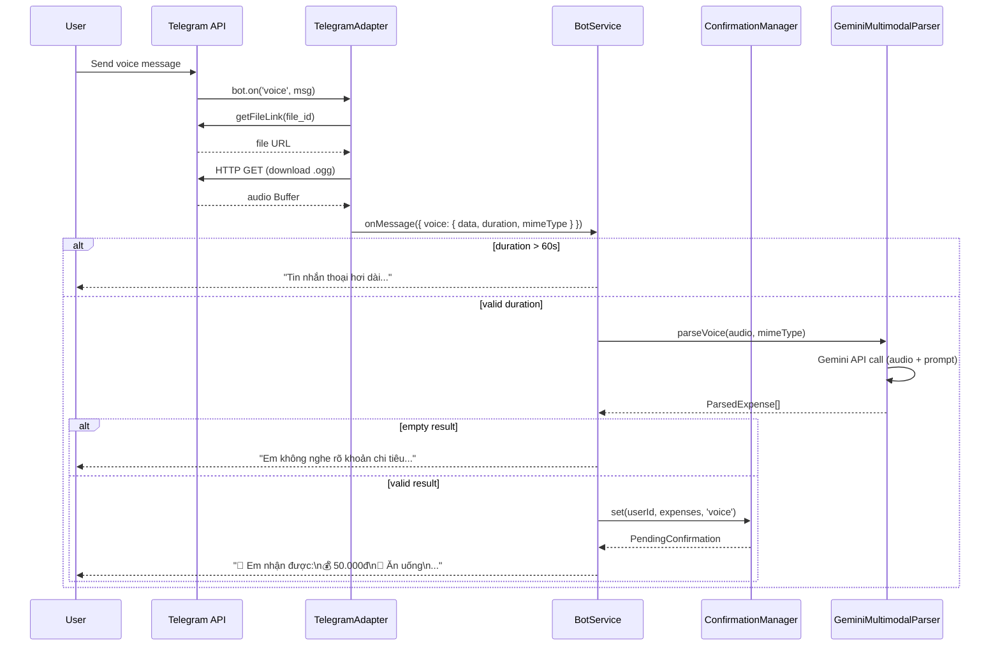
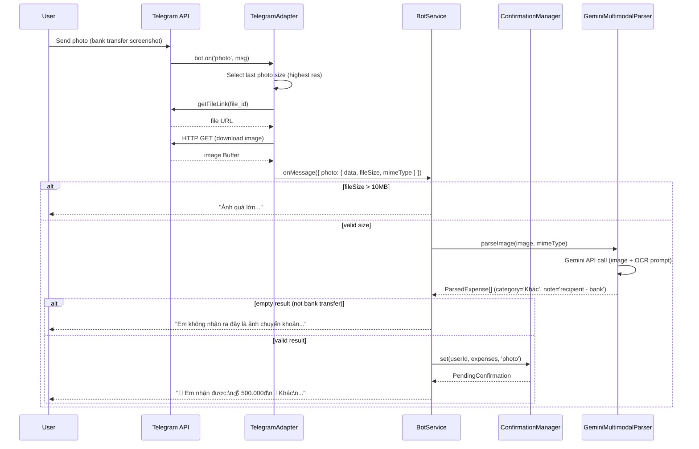
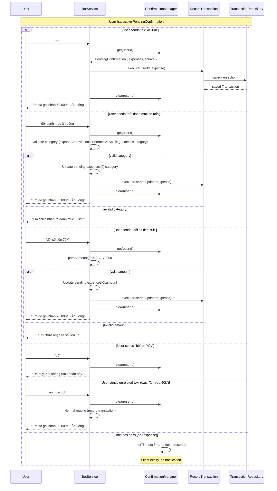

# Design Document: Voice and Image Input

## Overview

Feature này mở rộng Oh My Fast Tracker với khả năng nhận voice message và ảnh chuyển khoản ngân hàng, sử dụng Gemini 2.0 Flash multimodal để phân tích, kết hợp với confirmation flow cho phép user xác nhận/sửa/huỷ trước khi lưu giao dịch.

**Key design decisions:**
- **In-memory confirmation state** (Map per userId) — lightweight, no DB overhead, acceptable data loss on restart since confirmations expire after 5 minutes
- **Dedicated MultimodalParser port** — tách biệt khỏi text-only Parser, cho phép configure model riêng (gemini-2.0-flash cho multimodal vs gemini-3.5-flash-lite cho text)
- **Confirmation intercept at BotService level** — check pending state trước khi route message, nhưng SAU access check và /start, /help, id commands
- **Lazy expiry** (check-on-access + setTimeout cleanup) — không cần cron job, không block event loop

## Architecture

### High-Level Message Flow



### Component Interaction Diagram



## Components and Interfaces

### 1. Extended IncomingMessage (Domain Port)

```typescript
// src/domain/ports/ChannelAdapter.ts
export interface PhotoAttachment {
  data: Buffer;
  fileId: string;
  mimeType: string;  // 'image/jpeg' | 'image/png'
  fileSize: number;  // bytes
}

export interface VoiceAttachment {
  data: Buffer;
  fileId: string;
  mimeType: string;  // 'audio/ogg' | 'audio/oga'
  duration: number;  // seconds
}

export interface IncomingMessage {
  userId: string;
  channel: string;
  text: string;
  username?: string;
  photo?: PhotoAttachment;   // NEW
  voice?: VoiceAttachment;   // NEW
}
```

### 2. MultimodalParser Port (Domain)

```typescript
// src/domain/ports/MultimodalParser.ts
import { ParsedExpense } from './Parser';

export interface MultimodalParser {
  parseVoice(audio: Buffer, mimeType: string): Promise<ParsedExpense[]>;
  parseImage(image: Buffer, mimeType: string): Promise<ParsedExpense[]>;
}
```

### 3. ConfirmationManager (Application Service)

```typescript
// src/application/services/ConfirmationManager.ts
export interface PendingConfirmation {
  userId: string;
  expenses: ParsedExpense[];
  source: 'voice' | 'photo';
  createdAt: Date;
  timeoutHandle: ReturnType<typeof setTimeout>;
}

@Injectable()
export class ConfirmationManager {
  private readonly pending = new Map<string, PendingConfirmation>();
  private readonly EXPIRY_MS = 5 * 60 * 1000; // 5 minutes

  set(userId: string, expenses: ParsedExpense[], source: 'voice' | 'photo'): PendingConfirmation;
  get(userId: string): PendingConfirmation | undefined;  // lazy expiry check
  clear(userId: string): void;
  has(userId: string): boolean;  // lazy expiry check
}
```

**Design rationale:** Using `setTimeout` per entry for cleanup. The `get()` and `has()` methods also perform a timestamp check (belt-and-suspenders) so that even if setTimeout fires late, expired entries are never returned.

### 4. GeminiMultimodalParser (Infrastructure)

```typescript
// src/infrastructure/parsers/GeminiMultimodalParser.ts
@Injectable()
export class GeminiMultimodalParser implements MultimodalParser {
  constructor(@Inject(aiConfig.KEY) config: ConfigType<typeof aiConfig>) {
    // Uses config.geminiMultimodalModel (default: 'gemini-2.0-flash')
    // temperature: 0, responseMimeType: 'application/json'
  }

  async parseVoice(audio: Buffer, mimeType: string): Promise<ParsedExpense[]>;
  async parseImage(image: Buffer, mimeType: string): Promise<ParsedExpense[]>;
}
```

### 5. Updated TelegramAdapter (Infrastructure)

Extends current adapter to handle `photo` and `voice` Telegram events, download media via `bot.getFileLink()` + HTTP fetch, and populate IncomingMessage with attachments.

### 6. Updated BotService (Infrastructure)

New routing logic inserted after access check:
1. `/start`, `/help`, `id` → execute immediately (bypass confirmation)
2. Check if IncomingMessage has `voice` or `photo` → validate size/duration → send to MultimodalParser → create PendingConfirmation
3. Check `ConfirmationManager.has(userId)` → if yes, parse as confirmation command
4. If confirmation command matches (ok/lưu, đổi danh mục, đổi số tiền, bỏ/hủy) → handle
5. If no match → clear pending, fall through to normal routing
6. Normal text routing (existing logic unchanged)

## Data Models

### PendingConfirmation

| Field | Type | Description |
|-------|------|-------------|
| userId | string | Internal user ID (from access check) |
| channelUserId | string | Telegram chat ID (for sending messages) |
| expenses | ParsedExpense[] | Parsed expense data from AI |
| source | 'voice' \| 'photo' | Input source for icon display |
| createdAt | Date | Timestamp for expiry check |
| timeoutHandle | NodeJS.Timeout | setTimeout reference for cleanup |

### Confirmation Commands (Regex patterns)

| Command | Pattern | Action |
|---------|---------|--------|
| Confirm | `/^(ok\|lưu)$/i` | Save all expenses |
| Change category | `/^đổi\s*danh\s*mục\s+(.+)$/i` | Update category, save |
| Change amount | `/^đổi\s*số\s*tiền\s+(.+)$/i` | Update amount, save |
| Cancel | `/^(bỏ\|hủy)$/i` | Discard pending |

### Configuration Changes

```typescript
// Added to aiConfig in app.config.ts
export const aiConfig = registerAs("ai", () => ({
  geminiApiKey: requireEnv("GEMINI_API_KEY"),
  geminiModel: process.env.GEMINI_MODEL ?? "gemini-3.5-flash-lite",
  geminiMultimodalModel: process.env.GEMINI_MULTIMODAL_MODEL ?? "gemini-2.0-flash",  // NEW
}));
```

### Environment Variables (.env additions)

```
GEMINI_MULTIMODAL_MODEL=gemini-2.0-flash   # optional, defaults to gemini-2.0-flash
```

## Sequence Diagrams

### Voice Message Flow



### Photo Message Flow



### Confirmation Flow



## Correctness Properties

*A property is a characteristic or behavior that should hold true across all valid executions of a system — essentially, a formal statement about what the system should do. Properties serve as the bridge between human-readable specifications and machine-verifiable correctness guarantees.*

### Property 1: Confirmation message formatting

*For any* valid ParsedExpense (amount > 0, non-empty category, non-empty note) and any source type ('voice' | 'photo'), the generated confirmation message SHALL contain: the source indicator icon (🎤 for voice, 📸 for photo), the amount formatted with Vietnamese locale (dot-separated thousands), the category name, and the note text.

**Validates: Requirements 3.1, 3.2, 3.5**

### Property 2: PendingConfirmation creation from valid parse results

*For any* valid ParsedExpense array (containing at least one item with amount > 0) returned by MultimodalParser from either voice or photo input, the ConfirmationManager SHALL store a PendingConfirmation with the correct expenses, source type, and the confirmation message SHALL be sent to the user.

**Validates: Requirements 1.3, 2.3**

### Property 3: Confirmation storage — one per user with replacement

*For any* userId and any sequence of PendingConfirmation set operations, the ConfirmationManager SHALL store at most one PendingConfirmation per userId, where each new `set()` replaces any existing entry and clears its timeout handle.

**Validates: Requirements 3.3, 3.4**

### Property 4: Confirm saves with correct amount sign

*For any* PendingConfirmation with valid expenses, when the user sends "ok" or "lưu", the saved transaction SHALL have a negative amount if the category is an income category (as defined by `isIncomeCategory()`), and a positive amount otherwise.

**Validates: Requirements 4.1**

### Property 5: Category and amount modification persists correctly

*For any* active PendingConfirmation and any valid category name recognized by the category detection pipeline (expandAbbreviations → normalizeSpelling → detectCategory), sending "đổi danh mục [name]" SHALL save a transaction with the resolved category. *For any* active PendingConfirmation and any valid amount string parseable by `extractAmount()`, sending "đổi số tiền [amount]" SHALL save a transaction with the parsed amount.

**Validates: Requirements 4.2, 4.3**

### Property 6: Invalid modification keeps pending state active

*For any* active PendingConfirmation and any string that is NOT recognized by the category detection pipeline, "đổi danh mục [invalid]" SHALL NOT clear the PendingConfirmation. *For any* active PendingConfirmation and any string that cannot be parsed as a valid amount, "đổi số tiền [invalid]" SHALL NOT clear the PendingConfirmation.

**Validates: Requirements 4.6, 4.7**

### Property 7: Non-confirmation text clears pending and routes normally

*For any* text message that does not match confirmation command patterns (ok, lưu, đổi danh mục, đổi số tiền, bỏ, hủy) and is not a voice/photo message, when the user has an active PendingConfirmation, the system SHALL clear the pending state and process the message through normal text routing.

**Validates: Requirements 4.5**

### Property 8: "Đổi" commands without pending state fall through to normal routing

*For any* text matching "đổi danh mục [X]" or "đổi số tiền [X]" patterns, when the user has NO active PendingConfirmation, the message SHALL be processed through normal text routing (not treated as a confirmation command).

**Validates: Requirements 4.9**

### Property 9: Existing commands take priority over confirmation flow

*For any* text message matching existing command patterns (undo, edit, report, trend, compare, notification preferences) and any active PendingConfirmation, the command SHALL execute and the PendingConfirmation SHALL be cleared.

**Validates: Requirements 10.4**

### Property 10: Input validation rejects oversized media

*For any* voice message with duration > 60 seconds, the system SHALL reject it with the duration error message without calling the parser. *For any* photo with file size > 10MB, the system SHALL reject it with the size error message without calling the parser.

**Validates: Requirements 9.3, 9.4**

## Error Handling

### Error Categories and Responses

| Error Scenario | Vietnamese Message | Log Level |
|---|---|---|
| Gemini API network/rate-limit/server error | "Hệ thống đang gặp sự cố tạm thời, sếp thử lại sau nhé 🙏" | ERROR |
| Gemini returns invalid JSON | "Em xử lý chưa được, sếp thử gửi lại hoặc gõ text như bình thường nhé 🙏" | WARN |
| Voice: no expense detected | "Em không nghe rõ khoản chi tiêu trong tin nhắn thoại. Sếp thử ghi âm lại rõ hơn nhé 🎤" | DEBUG |
| Photo: not a bank transfer | "Em không nhận ra đây là ảnh chuyển khoản. Sếp gửi ảnh màn hình giao dịch từ app ngân hàng nhé 📸" | DEBUG |
| Voice duration > 60s | "Tin nhắn thoại hơi dài, sếp ghi âm ngắn gọn hơn (dưới 1 phút) nhé 🎤" | DEBUG |
| Photo size > 10MB | "Ảnh quá lớn, sếp gửi ảnh chụp màn hình bình thường (dưới 10MB) nhé 📸" | DEBUG |
| File download failure | "Hệ thống đang gặp sự cố tạm thời, sếp thử lại sau nhé 🙏" | ERROR |
| Invalid amount in "đổi số tiền" | "Em chưa nhận ra số tiền. Sếp thử gõ dạng: đổi số tiền 50k" | DEBUG |
| Invalid category in "đổi danh mục" | Category list message | DEBUG |

### Error Handling Strategy

1. **Fail-safe**: All errors in the multimodal pipeline result in a user-friendly Vietnamese message. No stack traces or technical errors exposed to user.
2. **Logging**: `Logger.error()` for infrastructure failures (API, download), `Logger.warn()` for unexpected AI output, `Logger.debug()` for expected "no result" cases.
3. **No content logging**: Audio buffers and image buffers are NEVER logged. Only metadata (userId, messageType, fileSize, duration, error message) are logged.
4. **Graceful degradation**: If multimodal parsing fails, user can always fall back to text input (`"ăn trưa 50k"`).

## Testing Strategy

### Property-Based Testing (fast-check)

The project already uses `fast-check` (v4.9.0). Property tests will validate the 10 correctness properties above.

**Configuration:**
- Minimum 100 iterations per property
- Each test tagged with: `// Feature: voice-and-image-input, Property N: [description]`
- Test file: `test/confirmation/confirmation-manager.spec.ts`, `test/confirmation/confirmation-flow.spec.ts`

**Key generators:**
- `arbParsedExpense`: generates valid ParsedExpense with random amounts (1000–10M), random categories from the 14 Vietnamese categories, random note strings
- `arbConfirmationSource`: `fc.constantFrom('voice', 'photo')`
- `arbConfirmationCommand`: generates valid/invalid confirmation commands
- `arbAmountString`: generates valid amount strings (50k, 1tr, 1tr5, 200000)
- `arbCategoryString`: generates valid/invalid Vietnamese category names

### Unit Tests (Jest)

- **ConfirmationManager**: set/get/clear/has, expiry behavior, replacement
- **GeminiMultimodalParser**: prompt construction, response parsing (mock Gemini SDK)
- **BotService routing**: voice/photo message handling, confirmation command routing, priority ordering
- **TelegramAdapter**: photo/voice event handling, file download, highest-res selection

### Integration Tests

- **End-to-end flow**: voice → parse → confirm → save (with mocked Gemini)
- **End-to-end flow**: photo → parse → confirm → save (with mocked Gemini)
- **Non-interference**: existing 265 tests continue to pass

### Module Registration

```typescript
// infrastructure.module.ts additions
providers: [
  // ... existing
  GeminiMultimodalParser,
  { provide: "MultimodalParser", useClass: GeminiMultimodalParser },
]

// application.module.ts additions
providers: [
  // ... existing
  ConfirmationManager,
]
```
