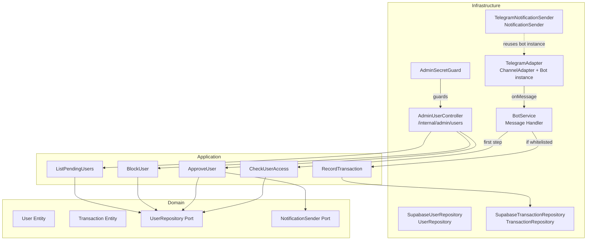

# Design Document: Whitelist Access Control

## Overview

This design implements whitelist-based access control for the Oh My Fast Tracker Telegram bot. The system gates all bot interactions behind a user status check (`whitelisted`, `pending`, `blocked`), auto-registers new users as `pending`, and exposes an internal Admin API for operators to manage user access. Additionally, a `channel` column is added to transactions for multi-channel analytics support, and a `plan` placeholder column is added to users for future subscription enforcement.

The design follows the existing Clean Architecture layers:
- **Domain**: New `User` entity, `UserRepository` port, `NotificationSender` port
- **Application**: New use cases (`CheckUserAccess`, `RegisterPendingUser`, `ApproveUser`, `ListPendingUsers`, `BlockUser`); modified `RecordTransaction` use case
- **Infrastructure**: `SupabaseUserRepository`, `TelegramNotificationSender`, `AdminUserController`, `AdminSecretGuard`, modified `BotService`

Key design decisions:
- Access check happens as the **first step** in BotService's message handler — no separate middleware or interceptor
- `NotificationSender` reuses the existing `TelegramBot` instance from `TelegramAdapter` via DI (shared reference, not a new connection)
- No caching of access check results — every message triggers a fresh DB lookup
- Admin API lives under `/internal/admin/*` with no CORS and a constant-time secret comparison guard

---

## Architecture



**Message Flow:**
1. `TelegramAdapter` receives message → invokes `BotService` handler
2. `BotService` calls `CheckUserAccess.execute(channel, channelUserId, username)`
3. If `allowed=false`: send appropriate reply (welcome vs. pending/blocked) and return
4. If `allowed=true`: proceed with existing routing (id, compare, trend, report, transaction)

**Admin Flow:**
1. HTTP request hits `/internal/admin/*`
2. `AdminSecretGuard` validates `X-Admin-Secret` header using `crypto.timingSafeEqual`
3. If valid → controller action executes use case
4. `ApproveUser` updates DB first, then fires notification (fire-and-forget, log on failure)

---

## Components and Interfaces

### Domain Layer

#### User Entity (`src/domain/entities/User.ts`)

```typescript
export type AccessStatus = 'pending' | 'whitelisted' | 'blocked';
export type SubscriptionPlan = 'free' | 'pro' | 'max';

export interface User {
  id?: string;
  channel: string;
  channelUserId: string;
  channelUsername?: string | null;
  accessStatus: AccessStatus;
  plan: SubscriptionPlan;
  whitelistedAt?: Date | null;
  planUpdatedAt?: Date | null;
  createdAt?: Date;
  updatedAt?: Date;
}
```

#### UserRepository Port (`src/domain/ports/UserRepository.ts`)

```typescript
import { User, AccessStatus } from '../entities/User';

export interface UserRepository {
  findByChannelAndUserId(channel: string, channelUserId: string): Promise<User | null>;
  create(user: Omit<User, 'id' | 'createdAt' | 'updatedAt'>): Promise<User>;
  updateAccessStatus(id: string, status: AccessStatus, whitelistedAt?: Date): Promise<User>;
  findById(id: string): Promise<User | null>;
  findByStatus(status: AccessStatus): Promise<User[]>;
}
```

#### NotificationSender Port (`src/domain/ports/NotificationSender.ts`)

```typescript
export interface NotificationSender {
  sendMessage(channelUserId: string, text: string): Promise<void>;
}
```

#### Modified Transaction Entity (`src/domain/entities/Transaction.ts`)

```typescript
export interface Transaction {
  id?: string;
  userId: string;
  amount: number;
  category: string;
  note: string;
  channel?: string;
  spentAt?: Date;
  createdAt?: Date;
}
```

### Application Layer

#### CheckUserAccess Use Case

```typescript
export interface CheckUserAccessResult {
  allowed: boolean;
  isFirstMessage: boolean;
  user: User;
}

@Injectable()
export class CheckUserAccess {
  constructor(@Inject('UserRepository') private readonly userRepository: UserRepository) {}

  async execute(channel: string, channelUserId: string, channelUsername?: string | null): Promise<CheckUserAccessResult>;
}
```

**Logic:**
1. Look up user by `(channel, channelUserId)`
2. If not found → create with `accessStatus: 'pending'` → return `{ allowed: false, isFirstMessage: true, user }`
3. If found with `accessStatus === 'whitelisted'` → return `{ allowed: true, isFirstMessage: false, user }`
4. If found with `accessStatus === 'pending' | 'blocked'` → return `{ allowed: false, isFirstMessage: false, user }`

#### ApproveUser Use Case

```typescript
@Injectable()
export class ApproveUser {
  constructor(
    @Inject('UserRepository') private readonly userRepository: UserRepository,
    @Inject('NotificationSender') private readonly notificationSender: NotificationSender,
  ) {}

  async execute(userId: string): Promise<User>;
}
```

**Logic:**
1. Find user by ID → throw NotFoundException if not found
2. Update access status to `whitelisted` with `whitelistedAt = new Date()`
3. Fire-and-forget: send approval notification to user's channelUserId
4. On notification failure: log warning, do NOT throw
5. Return updated user

#### BlockUser Use Case

```typescript
@Injectable()
export class BlockUser {
  constructor(@Inject('UserRepository') private readonly userRepository: UserRepository) {}

  async execute(userId: string): Promise<User>;
}
```

#### ListPendingUsers Use Case

```typescript
@Injectable()
export class ListPendingUsers {
  constructor(@Inject('UserRepository') private readonly userRepository: UserRepository) {}

  async execute(status?: AccessStatus): Promise<User[]>;
}
```

#### Modified RecordTransaction Use Case

Add `channel` parameter to `execute`:

```typescript
async execute(userId: string, rawText: string, channel: string = 'telegram'): Promise<Transaction[]>
```

Pass `channel` to each transaction object before saving.

### Infrastructure Layer

#### SupabaseUserRepository

Follows the same pattern as `SupabaseTransactionRepository`:
- Injects `supabaseConfig.KEY` to get URL and service key
- Creates a `SupabaseClient` in constructor
- Maps snake_case DB columns ↔ camelCase entity fields

#### TelegramNotificationSender

```typescript
@Injectable()
export class TelegramNotificationSender implements NotificationSender {
  constructor(
    @Inject('ChannelAdapter') private readonly channelAdapter: ChannelAdapter,
  ) {}

  async sendMessage(channelUserId: string, text: string): Promise<void> {
    await this.channelAdapter.sendText(channelUserId, text);
  }
}
```

**Rationale:** Reuses the existing `TelegramAdapter` (which holds the `TelegramBot` instance) via its `ChannelAdapter` interface. No new bot connection is created.

#### AdminSecretGuard

```typescript
@Injectable()
export class AdminSecretGuard implements CanActivate {
  constructor(@Inject(adminConfig.KEY) private readonly config: ConfigType<typeof adminConfig>) {}

  canActivate(context: ExecutionContext): boolean {
    const request = context.switchToHttp().getRequest();
    const provided = request.headers['x-admin-secret'] ?? '';
    const expected = this.config.secret;

    if (!provided || !expected) return false;

    const providedBuf = Buffer.from(provided, 'utf8');
    const expectedBuf = Buffer.from(expected, 'utf8');

    if (providedBuf.length !== expectedBuf.length) return false;

    return crypto.timingSafeEqual(providedBuf, expectedBuf);
  }
}
```

On failure, throws `UnauthorizedException` with `{ message: 'Unauthorized' }`.

#### AdminUserController

Routes:
- `GET /internal/admin/users?status=pending|whitelisted|blocked` → `ListPendingUsers`
- `POST /internal/admin/users/:userId/approve` → `ApproveUser`
- `POST /internal/admin/users/:userId/block` → `BlockUser`

Entire controller is decorated with `@UseGuards(AdminSecretGuard)`.

#### BotService Modifications

In `onModuleInit`, the message handler is modified to add access check as the **first step** after the `/^id$/i` debug command:

```typescript
// Access check (first step before any routing)
try {
  const accessResult = await this.checkUserAccess.execute(
    message.channel,
    message.userId,
    message.username,  // from IncomingMessage metadata
  );

  if (!accessResult.allowed) {
    if (accessResult.isFirstMessage) {
      await this.channelAdapter.sendText(message.userId, WELCOME_MSG);
    } else {
      await this.channelAdapter.sendText(message.userId, PENDING_MSG);
    }
    return;
  }
} catch (error) {
  this.logger.error('Access check failed', error);
  await this.channelAdapter.sendText(message.userId, SERVICE_UNAVAILABLE_MSG);
  return;
}
```

#### IncomingMessage Extension

Add optional `username` field to `IncomingMessage`:

```typescript
export interface IncomingMessage {
  userId: string;
  channel: string;
  text: string;
  username?: string | null;
}
```

`TelegramAdapter` populates this from `msg.from?.username`.

#### Config Changes

New config in `app.config.ts`:

```typescript
export const adminConfig = registerAs('admin', () => ({
  secret: requireEnv('ADMIN_API_SECRET'),
}));
```

#### Module Wiring

**InfrastructureModule** additions:
- `ConfigModule.forFeature(adminConfig)`
- `{ provide: 'UserRepository', useClass: SupabaseUserRepository }`
- `{ provide: 'NotificationSender', useClass: TelegramNotificationSender }`
- Export `'UserRepository'` and `'NotificationSender'`

**ApplicationModule** additions:
- `CheckUserAccess`, `ApproveUser`, `BlockUser`, `ListPendingUsers` providers
- Export all new use cases

**HttpModule** additions:
- Register `AdminUserController` in controllers array
- Register `AdminSecretGuard` as a provider

---

## Data Models

### Database Schema Changes

#### Migration SQL (`sql/002-whitelist-access-control.sql`)

```sql
-- Add access control columns to users table
ALTER TABLE users ADD COLUMN IF NOT EXISTS channel_username text;
ALTER TABLE users ADD COLUMN IF NOT EXISTS access_status text NOT NULL DEFAULT 'pending';
ALTER TABLE users ADD COLUMN IF NOT EXISTS plan text NOT NULL DEFAULT 'free';
ALTER TABLE users ADD COLUMN IF NOT EXISTS whitelisted_at timestamptz;
ALTER TABLE users ADD COLUMN IF NOT EXISTS plan_updated_at timestamptz;
ALTER TABLE users ADD COLUMN IF NOT EXISTS updated_at timestamptz NOT NULL DEFAULT now();

-- Add channel column to transactions table
ALTER TABLE transactions ADD COLUMN IF NOT EXISTS channel text NOT NULL DEFAULT 'telegram';

-- Indexes
CREATE INDEX IF NOT EXISTS idx_users_access_status ON users(access_status);
CREATE INDEX IF NOT EXISTS idx_transactions_channel_user ON transactions(channel, user_id);
```

#### Backfill SQL (`sql/003-backfill-whitelist.sql`)

```sql
-- Backfill: insert whitelisted records for all existing transaction users
INSERT INTO users (channel, channel_user_id, access_status, plan, whitelisted_at)
SELECT DISTINCT 'telegram', user_id, 'whitelisted', 'free', now()
FROM transactions
WHERE user_id IS NOT NULL
ON CONFLICT (channel, channel_user_id) DO NOTHING;

-- Upsert test user
INSERT INTO users (channel, channel_user_id, access_status, plan, whitelisted_at)
VALUES ('telegram', '7046661244', 'whitelisted', 'free', now())
ON CONFLICT (channel, channel_user_id)
DO UPDATE SET access_status = 'whitelisted', whitelisted_at = now(), updated_at = now();
```

### Entity-to-DB Mapping

| Entity Field      | DB Column          | Type          |
|-------------------|--------------------|---------------|
| id                | id                 | uuid (PK)     |
| channel           | channel            | text          |
| channelUserId     | channel_user_id    | text          |
| channelUsername   | channel_username   | text (nullable)|
| accessStatus      | access_status      | text          |
| plan              | plan               | text          |
| whitelistedAt     | whitelisted_at     | timestamptz   |
| planUpdatedAt     | plan_updated_at    | timestamptz   |
| createdAt         | created_at         | timestamptz   |
| updatedAt         | updated_at         | timestamptz   |

---

## Correctness Properties

*A property is a characteristic or behavior that should hold true across all valid executions of a system — essentially, a formal statement about what the system should do. Properties serve as the bridge between human-readable specifications and machine-verifiable correctness guarantees.*

### Property 1: Access check gates all message processing

*For any* incoming message from a user whose accessStatus is `pending` or `blocked`, the system SHALL NOT invoke any downstream use case (RecordTransaction, GenerateWeeklyReport, GenerateTrendReport) and SHALL send a rejection reply. Conversely, for any user with accessStatus `whitelisted`, the system SHALL proceed with normal message routing.

**Validates: Requirements 1.2, 1.3**

### Property 2: New users are always registered as pending

*For any* incoming message where the (channel, channelUserId) pair does not exist in the UserRepository, the system SHALL create a new user record with accessStatus `pending` and return `isFirstMessage=true`.

**Validates: Requirements 1.5, 2.1**

### Property 3: Access status trichotomy

*For any* user record returned by CheckUserAccess, the accessStatus field SHALL be exactly one of `'whitelisted'`, `'pending'`, or `'blocked'` — no other values are possible.

**Validates: Requirements 1.7**

### Property 4: Blocked users receive the same reply as pending users

*For any* message from a blocked user, the reply text SHALL be identical to the reply sent to a non-first-time pending user, making it impossible for the user to distinguish between being blocked and being pending.

**Validates: Requirements 2.4**

### Property 5: Admin guard correctness

*For any* HTTP request to the Admin API, the request SHALL be forwarded to the controller action if and only if the `X-Admin-Secret` header value exactly matches the configured admin secret. All non-matching values (including empty, missing, or partial matches) SHALL result in HTTP 401.

**Validates: Requirements 3.1, 3.2**

### Property 6: Approve then access is immediate

*For any* user that transitions from `pending` to `whitelisted` via ApproveUser, the next invocation of CheckUserAccess for that user SHALL return `allowed=true` without any cache invalidation or restart.

**Validates: Requirements 5.4**

### Property 7: Block then deny is immediate

*For any* user that transitions from `whitelisted` to `blocked` via BlockUser, the next invocation of CheckUserAccess for that user SHALL return `allowed=false` on the next message.

**Validates: Requirements 6.4**

### Property 8: Approve is idempotent

*For any* user already in `whitelisted` status, calling ApproveUser SHALL update `whitelistedAt` to the current timestamp and return success without error — the operation is idempotent.

**Validates: Requirements 5.6**

### Property 9: Block is idempotent

*For any* user already in `blocked` status, calling BlockUser SHALL return success with the current state without error.

**Validates: Requirements 6.3**

### Property 10: Transaction channel round-trip

*For any* transaction saved with a given `channel` value via RecordTransaction, retrieving that transaction via `findByUserAndDateRange` SHALL return the same `channel` value in the entity.

**Validates: Requirements 9.1, 9.2, 9.4, 9.5**

### Property 11: Status filter returns only matching users

*For any* set of users in the repository and any valid status filter (`pending`, `whitelisted`, or `blocked`), the ListPendingUsers use case SHALL return only users whose accessStatus matches the filter, ordered by createdAt ascending.

**Validates: Requirements 4.1, 4.4**

### Property 12: Plan does not affect access decisions

*For any* user with accessStatus `whitelisted` and any plan value (`free`, `pro`, or `max`), the CheckUserAccess result SHALL be `allowed=true` — the plan field SHALL NOT influence access control logic.

**Validates: Requirements 10.2**

---

## Error Handling

| Scenario | Behavior |
|----------|----------|
| UserRepository lookup fails (connection/timeout) | BotService catches error, sends "service temporarily unavailable" reply, does NOT process message |
| UserRepository create fails | BotService catches error, sends generic error reply, does NOT process message |
| NotificationSender fails on approval | ApproveUser logs warning, returns success response with approved user data |
| Admin API missing/invalid secret | AdminSecretGuard returns HTTP 401 `{ "message": "Unauthorized" }` |
| Admin API userId not found | Controller returns HTTP 404 |
| Admin API invalid status query param | Controller returns HTTP 400 with error message |
| ADMIN_API_SECRET env var missing | Application fails to start with configuration error |
| Migration SQL fails | Script logs error, exits with non-zero code |

**Timeout Strategy:**
- Database operations use Supabase client defaults (no custom timeout in this iteration)
- The 5-second timeout mentioned in requirements will be handled by Supabase client's built-in request timeout configuration

---

## Testing Strategy

### Property-Based Tests (fast-check)

Library: **fast-check** (already compatible with Jest in this project)

Each property test runs a minimum of 100 iterations and is tagged with its design property reference.

| Property | Test Description | Generator Strategy |
|----------|-----------------|-------------------|
| P1 | Access check gates processing | Generate random access statuses (`pending`/`blocked`), random messages, verify no downstream call. For `whitelisted`, verify routing proceeds. |
| P2 | New users registered as pending | Generate random (channel, userId) pairs not in repo, verify creation with `pending` status |
| P3 | Access status trichotomy | Generate random user records, verify status is always one of three valid values |
| P4 | Blocked = pending reply | Generate blocked and returning-pending users, verify identical reply text |
| P5 | Admin guard correctness | Generate random strings for the secret header, verify pass iff exact match |
| P6 | Approve → immediate access | Generate pending users, approve, verify next CheckUserAccess returns allowed |
| P7 | Block → immediate deny | Generate whitelisted users, block, verify next CheckUserAccess returns denied |
| P8 | Approve idempotent | Generate already-whitelisted users, approve again, verify success and updated timestamp |
| P9 | Block idempotent | Generate already-blocked users, block again, verify success without error |
| P10 | Transaction channel round-trip | Generate random channel strings, save via RecordTransaction, retrieve, verify channel equality |
| P11 | Status filter correctness | Generate random user sets with mixed statuses, filter by each status, verify only matching users returned in createdAt order |
| P12 | Plan does not affect access | Generate whitelisted users with varying plan values, verify CheckUserAccess always returns allowed |

### Unit Tests (Jest)

- **CheckUserAccess**: Test each branch (new user, whitelisted, pending, blocked)
- **BotService**: Test message routing with mocked CheckUserAccess (verify welcome msg, pending msg, pass-through)
- **BotService error handling**: Test DB failure → service unavailable reply
- **AdminSecretGuard**: Test valid secret, invalid secret, missing header, empty header, constant-time implementation
- **AdminUserController**: Test each endpoint with mocked use cases, validate 404 for unknown userId, 400 for invalid status
- **ApproveUser**: Test success, user not found, notification failure handling (fire-and-forget)
- **BlockUser**: Test success, user not found, already blocked

### Integration Tests

- **Migration scripts**: Verify idempotency by running migration twice against a test database
- **Backfill**: Verify existing transaction users are whitelisted after backfill
- **End-to-end admin flow**: POST approve → verify user can send messages
- **Deployment order verification**: Verify test user 7046661244 is whitelisted, transactions have channel column

### Test Tag Format

```typescript
// Feature: whitelist-access-control, Property 1: Access check gates all message processing
```
